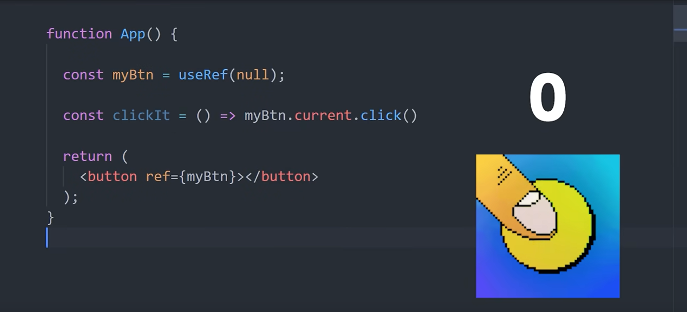
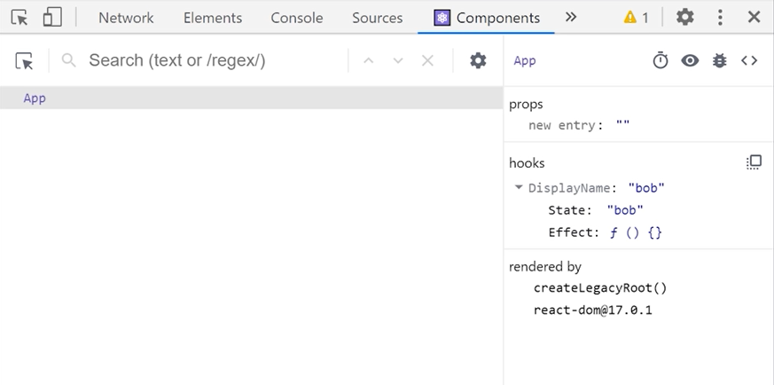

# 10 React Hooks - Explained

React hooks use features of the React framework by calling special **hook** functions from within a component. 

We can build static - dumb - components in react by writing functions, however UI components are often dynamic. Meaning they may need to change the state of their data, react to lifecycle events, access elements from the DOM, among many other things. 

Prior to **React 16.8** developers were required to write *classes* to take advantage of certain React features.

You can still use classes in React, but hooks generally provide a more ergonomic way to build components because you can reuse stateful logic without changing your component hierarchy. 

 

### Several built-in hooks

React has several built-in hooks, which can be categorized into basic and additional hooks. 

### Basic Hooks
1. **useState**: Allows you to add state to functional components.
2. **useEffect**: Lets you perform side effects in function components.
3. **useContext**: Provides a way to pass data through the component tree without having to pass props down manually at every level.

### Additional Hooks
4. **useReducer**: An alternative to `useState` for managing complex state logic.
5. **useCallback**: Returns a memoized callback function.
6. **useMemo**: Returns a memoized value.
7. **useRef**: Provides a way to access and persist a mutable value across renders.
8. **useImperativeHandle**: Customizes the instance value that is exposed when using `ref`.
9. **useLayoutEffect**: Similar to `useEffect`, but fires synchronously after all DOM mutations.
10. **useDebugValue**: Can be used to display a label for custom hooks in React DevTools.

These hooks cover a wide range of use cases for managing state, side effects, context, and more in React functional components. 

  

In the past, *stateful* logic (data that changes within the application) was tightly coupled to a class-based component.

 This means that in order to work with reactive data, you needed to create a component. This seems reasonable, but what it led to in reality was a complex tree of nested components.

With this implementation, sharing any logic required some frustrating jujitsu, such as higher order components and render props, which are patterns that have you passing components as arguments to other components - which was much more complex than patterns found in Angular and other frameworks. 

  

Fortunately, hooks changed everything by giving us access to lower-level features of React outside of the context of a component. 

### Think of hooks like primitives or building blocks of the React framework

They give you special abilities that you wouldn't otherwise have with vanilla JS. 

The hooks themselves are functions that always start with the word `use` - because you are *using* the super powers of the React framework.

  

### One rule to be aware of:

When using hooks you should only ever call them at the **top level** of a functional component - they don't work inside of regular JS functions (as seen below), nested functions, loops, or anything like that. 

**Exception to the rule:** when using custom hooks!

   

- easily the most important and often used hook
- used to handle *reactive* data
- data in the app that changes is called **"state"**
- When state changes, this should be reflected in the UI

- hook takes one optional argument - **the default state**
- function returns an array, containing 2 values you can use in component

- returned in an array because we can destructure them with JS to easily asign the values to local vars that can be named whatever - state and setter function
- implementation of `useState` in FC's is much cleaner compared to class components, as seen below:

   

- one of the most confusing hooks
- must understand the **"component lifecycle"** to understand `useEffect`
- snippet below is from a **class component**
- here we're implementing methods to *handle* different lifecycle events

- here's a simplified version of the component lifecycle:

- `componentDidMount`: component is added to the UI - or *mounted* **(can only happen once)**
- `componentDidUpdate`: reactive data on the component can change / is updated **(can happen multiple times)**
- `componentWillUnmount`: component will be removed from UI - or *unmounted* **(can only happen once)**

Keep the above *lifecycle events* in mind when talking about `useEffect` hook

 

- `useEffect` allows us to implement logic for each lifecycle event within a single function API
- `useEffect` takes a function that you define (as its first argument)
- React will then *run* your function - or **"side effect"** - after it has updated the DOM
- With below, it will run the function any time stateful data changes on the component
- Means it will run once when component is initialized with default value
- Then run again each time state (`count`) is updated

In most cases though, you'll likely want more fine-grained control over that behaviour. For example, imagine...

- you need to fetch data when component is initialized
- then update the state asynchronously after data's been fetched
- below would result in an infinite loop
- this is becuse each fetch updates state, which triggers re-render and another fetch etc.

- pass 2nd argument to `useEffect` to resolve this - array of dependencies 

- empty array === !dependencies **(will only run once when component mounts)**
- populated array === dependencies **(will run when state changes)**

 

#### Teardown functions / Cleanup functions

- might want to run some "teardown" code when the component is destroyed
- implement a **teardown function** by returning a function from our `useEffect` callback

- React will take the function returned, and call it when the component is destroyed

  

- `useContext` allows you to work with React's **context API**
- The Context API is a mechanism that allows you to share or scope values throughout the entire component tree

- Imagine you have an object called `moods` - happy or sad
- to share current mood across multiple disconnected components, we can create a **"context"**
  

- One part of the application might be "happy", so we use a context **Provider** to scope the happy mood there
- Now... any child component inside the **Provider** can inherit that value without needing to pass props down to the children 
- No need for prop drilling

- the `useContext` hook allows us to access - **"consume"** - the current value from the context **Provider** - even if the Provider lives many levels higher in the component tree
- reading a parent value with `useContext` is much easier than passing props down through multiple children layers - prop drilling

- In the above, if the mood changes from `happy` to `sad` in the parent **Provider**, the value here will be updated automatically

#### Consumer component

- the `useContext` hook is basically a much cleaner replacement for the **Consumer**

  

- Returns a mutable object that will keep the same reference between renders
- object contains a `.current` property
- object persists for the full lifetime of a component, meaning it doesn't get reset on re-renders
- You can use `useRef` to directly access a DOM element. This is useful for tasks like focusing an input, scrolling to a particular section, or measuring the size of an element.
- Can be used when you have a value that changes, kind of like `setState`
- **The key difference:** it doesn't trigger a re-render when the value changes

- For example, if you built a counter button with `useRef`, we can reference the current `count` by using `count.current`
- However, when we click the button the count would never change in the UI because `useRef` doesn't trigger a re-render like `setState` does
- This can be useful when you need a **mutable** value

 

### Common `useRef` use case: Grabbing native HTML elements from the DOM (JSX)

- start by creating a `null` reference called `myBtn`
- connect it to raw HTML `<button>` using `ref` attribute
- can then reference the HTML button in a function to call native DOM APIs like `click()`
- this would programmatically click the button

**The bottom line:** when you need to grab an element from the DOM, `useRef` is the hook you're looking for

  

- can be quite scary
- very similar to `setState`

- a different way to manage state - using **redux** pattern
- instead of updating state directly, you: 
    - *dispatch* actions that go to a `reducer` function
    - reducer function determines how to *compute* the next state

- just like `useState`, `useReducer` returns an array of TWO values
- **first value** = reactive state you want to show in the UI 

- **second value** = **where things get a bit different!**
    - instead of a function that updates the state, you're given a function that can *dispatch an action*
    - An **"action"** is just an object that has a **type**, which can be any string you want, plus an optional data **payload**

- you might *dispatch* an action when a button's clicked, which will trigger your **`reducer`** function

- the `reducer` function is something you define
- you then pass the `reducer` function to the `useReducer` hook
- `reducer` takes the current `state` and `action` as arguments
- it uses these values to *compute* the next state
- which is usually handled inside a `switch` statement

- in this case if the `action` is `"increment"` we add 1, and vice versa
- hook also takes **initial state** as its 2nd argument

### Why not just use `setState`? 

- `useReducer` helps your code manage complexity as it grows
- as you add more components to your app it becomes more difficult to manage state in a reliable and predictable way
- the **Redux** pattern can help with that
- although not everyone agrees with this

  

- can help optimise computational cost for improved performance

- **Caution:** use only as needed for expensive calculations
- you don't want to prematurely optimise performance
- think of this hook as an opt-in tool to deal with expensive computations that you know are hurting performance
  
- imagine we have a function called `expensiveCount` that requires some kind of expensive computation to return a result
- instead of *re-computing* on every render, we can *memoize* the value
- we write a function that returns the computed value, then as a **2nd argument** add the dependencies to determine when this computation should be run
- in this case, whenever `count` changes

`useMemo` is great for memoizing return values, but in other cases you may want to memoize an entire function, in which case you'll want...

  

- when you define a function in a component, a new function object is created each time the component is re-rendered
- usually this isn't a big deal for performance
- but in some cases, you may want to **memoize** the function

**Common use case:** when you pass the same function down to multiple child components

- by wrapping the function in `useCallback`, we can prevent unneccessary re-renders of the children 
- this is because they will always be using the same function object

   

If you build a reusable component library in React, you may need to get access to the underlying DOM element and then forward it - so it can be accessed by the consumers of your component library. 

- You can access a native DOM element with the `useRef` hook
- Then you can wrap the component in `forwardRef`
- This makes that ref available when someone uses this component
  
- `useImperativeHandle` comes in if you want to change the behaviour of the exposed ref
- you may want to modify the methods on the native element

- In reality, the need for this hook is probably pretty rare

  

- another rarely used hook
- works just like `useEffect`
- with one small difference:
    - your callback will run after rendering the component, but before painting to screen
    - means React will wait for your code to finish running before it updates the UI for the end user

- there may be situations where you need to calculate a scroll position - or something else in the UI - before the DOM is visually updated

  

This hook won't make sense until you start building your own custom hooks.

- If you open app in browser and open React dev tools
- You'll notice that every component in the tree will tell you a little bit about the **hooks** that are defined there

- The purpose of `useDebugValue` is to make it possible to define your own custom labels here in **React Dev Tools**
- we can build a custom hook to see that in action

### Building a custom hook:

- notice how the above component is using **two** hooks together - `useState` and `useEffect`
    - `useState` to define a display name for the user
    - `useEffect` to **fetch** that name from the database on the first render

 

### Define custom hook to handle this! 

- imagine we have **ten** *other* components that need to implement the *exact same logic*
- the great thing about hooks is we can easily do that by defining our own function called `useDisplayName`
- it's just a regular JS function that implements the same code we had in our component

- we can now put this custom hook to use in multiple components

 

### Add `useDebugValue`

One final touch here is to add `useDebugValue` to our custom hook.

- the argument passed to `useDebugValue` will be the value shown in React dev tools

- As you can see below:
    - it shows the `displayName` label
    - along with the value - `"bob"`
    - as well as a breakdown of the primitive hooks that went into this custom hook

