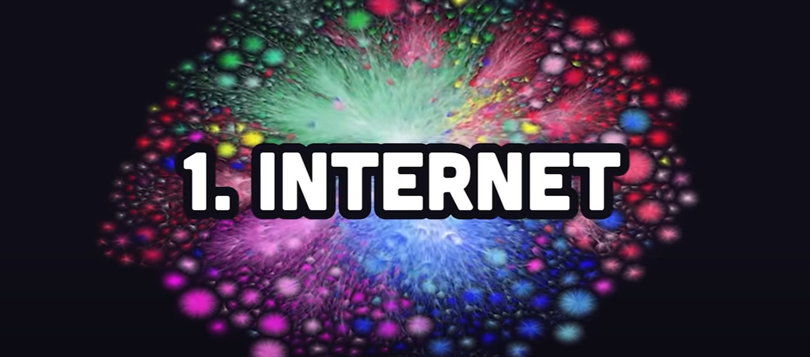
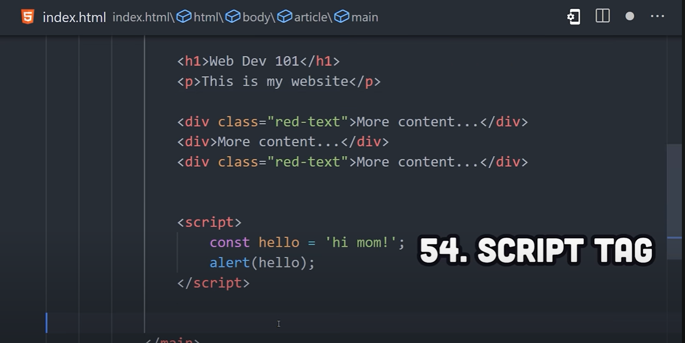
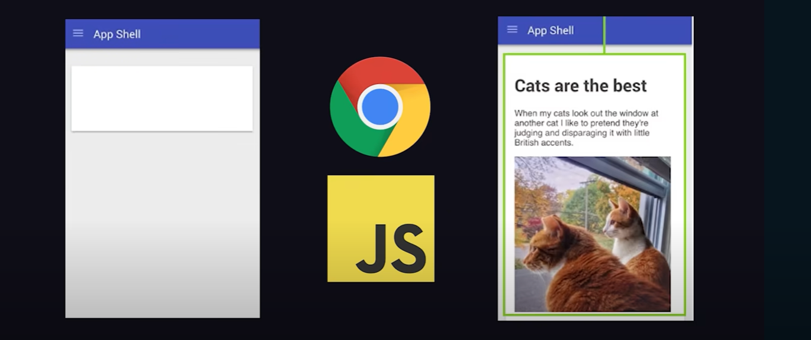

# 100 Web Dev Things You Should Know

### 1. Internet

A network of billions of machines connected together. It was officially born on January 1st 1983, thanks to the establishment of...

### 2. Internet Protocol Suite

Internet protocol suite standardized the way these computers communicate. 

**Protocol** = a set of rules governing the exchange or transmission of data between devices.

### 3. IP address

The IP (internet protocol) is used to identify different computers on the network by assigning each one of them a unique IP address.

### 4. Transmission Control Protocol

These computers can then send data back and forth with the TCP (transmission control protocol).

### 5. Packets

TCP breaks data into a bunch of small packets, kind of like the pieces of a jigsaw puzzle, then sends them through a bunch of physical components like fibre optic cables and modems, before they're put back together by the receiving computer.  

You can think of the internet as **hardware**, but the internet is not the same thing as the web.

### 6/7. Web/HTTP

The world wide web is like software that sits on top of the internet, where people can access pages with the HTTP (HyperText Transfer Protocol). 

HTTP is special because it gives every page of content a...

### 8. Uniform Resource Locator - URL

### 9. Browser

Humans typically use a tool called a web browser to access a URL, where it can be rendered visually on their screen.

### 10. Client

The browser is called "the client" because it's consuming information.

### 11. Server

But on the other end of that URL, there's another computer called a "server"...

### 12. Request

It received an HTTP request from the client...

### 13. Response

...then sent an HTTP response containing the webpage content.

### 14. HTTP Messages

These interactions are called HTTP messages - but more on that later. 

### 15. Domain Name

Every webpage has a unique domain name. A domain name can be registered by anyone via a registrar...

### 16/17. Registrar/ICANN

ICANN is a non-profit responsible for overseeing namespaces on the internet. 

### 18. Domain Name Server - DNS

When you navigate to a domain in a browser, it gets routed through the DNS, that maps these names to an actual IP address on a server somewhere. 

DNS is like the phonebook of the internet.

  

### 19. HyperText Markup Language - HTML

When you look at a web page, the actual content you see is represented by HyperText Markup Language. 

### 20. Dev Tools

Most browsers have dev tools, where you can inspect the structure of the HTML at any time. 

### 21. Editor

To build your own web page you'll want a text editor like VS code. 

### 22. Elements

An HTML document is just a collection of elements, where an element is an opening and closing tag with some content in the middle - like a paragraph and heading. 

It also has elements that handle user input, like the `<select>` and `<input>` elements, which are used to build forms. 

### 24. Attributes

In addition, elements can have one or more attributes to change their behavior. 

For example, an input can have a type like `text` or `number`, which the browser will then render differently to collect the appropriate value. 

### 25. Anchor

The element that puts the "HyperText" in HTML is the `` anchor tag. This is a link that allows one page to navigate to a different page based on its URL.

### 26. Document Object Model - DOM

HTML elements are nested together in a hierarchy to form the "document object model" or DOM. 

### 27. Head 

From the root element a web page is split into two parts - head and body. The head contains invisible content like metadata and a title.

### 28. Body

We have the body for the main content that the end user actually sees.

The reason we wrap everything in tags is to give browsers and bots hints about the semantic meaning of the web page. This allows search engines to display results properly and also helps with accessibility.

### 29. Accessibility

Semantics help with accessibity for devices like screen readers that allow anybody regardless of disability to enjoy the content. 

### 30. Div

One of the most common HTML elements you'll come across is `
` or "division", to define a section of the web page. 

  

### 40. CSS Box Model

Think of every HTML element like a box. The outside of that box is wrapped with padding, border and margin. The boxes then take up space on the page from top to bottom. 

### 41. Block

Some elements, like `<h1>` - `heading` - have a display of `block` by default, which means they take up all available horizontal space. 

### 42. Inline

Other elements, like `` are displayed inline, which means they can line up horizontally side-by-side. The problem is that the default position is usually not desirable. It can be changed by customizing the position property on an element. 

### 43. Relative

Relative positioning allows an element to move a certain number of pixels from its original position. 

### 44. Absolute

Absolute positioning is similar but the position values are relative to its nearest ancestor. 

### 45. Fixed

We then have fixed positioning, which will keep an element on the screen even as the user scrolls away from it, because it's fixed to the entire viewport. 

### 46. Responsive Layout

One of the biggest challenges developers face is creating responsive layouts. CSS provides a bunch of tools to help make this happen, one of which is media queries. 

### 47. Media Query

A media query allows you to get information about the device that's rendering the web page and apply different styles accordingly.

### 48. Flexbox

CSS also provides important layout tools like flexbox. Applying `display: flex` allows the parent to control the flow of the children - to easily create rows and columns. 

### 49. Grid Layout

For more complex layouts, `display: grid` can be used to display multiple rows and columns at the same time. 

  

### 50. Calc

CSS is not considered a turing-complete* programming language on its own, however, it does have *mechanisms* like `calc()` to perform mathematical operations.

    *Practically, what you need to know is that a Turing-complete language (also called a universal language) is one where you can compute anything that any other computational method can compute.

 

### 51. Custom Properties

It also has custom properties, that are like variables that you can use in multiple places. 

 

### 52. SASS

Vanilla CSS is rarely enough though, and many developers choose to extend it with tools like SASS, that add additional programmatic features on top of it.

  

### 53. JavaScript

Technically, you don't need JS to build a website. However, most developers choose to use it to make the user interface more interactive. 

### 54. Script Tag

The browser interprets the HTML in your file from top to bottom, and runs the code within the `<script>` tags when it encounters it in the DOM. 

### 55. Defer

In most cases, JS is written in a separate file, then referenced as the `src` on the `<script>` tag.  

Usually, *it's preferred that this code runs after the DOM content is loaded*, which can be accomplished with the `defer` attribute. 

 

### 56. EcmaScript

JavaScript is a BIG, complicated programming language, which is more formally known as **"EcmaScript"** and is standardized in all major browsers. 

 

### 59. Dynamically Typed

JS is a *dynamically typed* language, which means no type annotations are necessary. 

 

### 60. TypeScript

That's not always ideal, so many devs choose TypeScript as an alternative, to add static typing on top of JavaScript. 

 

### 61. Events

One of the most common reasons you would use JS in the first place is to handle events. 

Whenever a user does something on a web page, the browser emits an event that you can listen to - like a click, mouse move, form input change and so on.

 

### 62. Browser API 

We can tap into these events using browser APIs like **`document`**.

In this case, `document` provides a method called `querySelector()` that allows us to grab an element with a CSS selector. 

### 63. Event Listener

Once we have that element set as a variable, we can then asign an event listener to it. 

An event listener is a function that will be called, or re-executed, any time the button is clicked. 

 

### 66. Object

The most fundamental data structure is the object - also commonly called a "dictionary" or "hash map". 

### 67. Primitives

Anything that's **not** a primitive type, like a string or number, inherits its base functionality from the object class. 

 

### 68. Prototypal inheritance

It relies on a technique called prototypal inheritance, where an object can be cloned multiple times, to create a chain of ancestors, where the child inherits the properties and methods of its ancestors. 

### 69. Classes

This is different from class-based inheritance, which is kind of confusing, because JS also supports classes - however, these classes are just *syntactic sugar* from prototypal inheritance. 

  

However, this is all a little too low-level. Most developers don't ever want to have to touch the word "prototype", so what we do instead is use a **frontend framework**!! 

  

### 70. Frontend Framework 

**Common frameworks:**

- React
- Vue
- Svelte
- Angular

All of these frameworks do the same thing in a slightly different way, which is represent the UI as a tree of components. 

 

### 71. Components 

A component can *encapsulate* HTML, CSS and JS into a format that looks like its own custom HTML element. 

 

### 72. Declarative code

Most importantly, they produce declarative code that describes exactly what the UI does. 

This is much easier to work than...

### 73. Imperative code 

...and imperative code is what you would get with just plain vanilla JS. 

   

# Backend

### 74. Node.js

Node.js is a server-side **runtime** based on JavaScript.

You can run server-side code from web applications in all kinds of different languages...

...but Node is the most popular because it relies on the same language as the browser. 

 

### 75. V8 Engine

It's also based on the same V8 Engine that powers the chromium browser...

### 76. Event Loop

...to run code in a single-threaded, non-blocking event loop. 

This allows Node to handle many simultaneous connections quickly and efficiently. 

### 77. Node Package Manager - NPM

In addition, it allows developers to share work remotely thanks to the Node Package Manager - NPM.

### 78. Module

A package is also called a module, which is just a file that contains some code with an **export** statement, so it can be used in another file.

### 80. Import

The other file can consume the module by using an import statement.

  

### Rendering

But now, we need to figure out how to deliver the actual website from the server to the client... 

### 81. Server Side Rendering - SSR

The classic option is SSR. With this approach, the client will make a GET request for a certain URL.

### 82. HTTP Method

Every request has a HTTP Method, and GET means you want to retrieve data from a server - as opposed to methods like POST and PATCH, where the intent is to modify data. 

### 83. Status Code

The server receives the GET request, then generates all of the HTML on the server (SSR) and sends it back to the client as a RESPONSE. 

The response contains a **status code**, like 200 for success, or levels 400 and 500 for errors.

### 84. 404 Not Found

For example, if the web page doesn't exist, a server will return a 404 status code, which you've likely seen before as a web user. 

  

### 85. Single Page Application - SPA

**SSR** is extremely popular, but in some cases it may not be fast enough. 

Another approach is the **Single Page Application (SPA)**. With this approach, the server only renders a shell for the root URL...

    **NOTE**: CSR is the approach in which the HTML file rendering is done in the user's browser, while Single Page Application is the type of web app that incorporates this approach as its behavior. So CSR is the model under which SPAs operate.

...then JavaScript handles the rendering for all other pages on the website. 

The HTML is generated almost entirely client-side in the browser, making the website feel more like a native iOS or Android application. 

 

When the app needs more data, it still makes an HTTP request, but only requests a minimal amount of data as JSON.

### 86. JSON

JSON is referred to as a "data interchange format" that can be understood by ANY programming language. 

 

### The problem with SPAs...

Using SPAs with CSR - built using a frontend framework like React - can result in a great user experience. However, it can be difficult for bots, like search engines and social media link previews to understand content on the page. 

This phenom lead to another rendering strategy called...

### 87. Static Site Generation - SSG

With SSG, every web page on the site is uploaded to a server in advance...

...allowing bots to get the information they need...

### 88. Hydration

A frontend JavaScript framework usually takes over to *hydrate* the HTML, to make it fully interactive and behave like a Single Page Application. 

### 89. First Contentful Paint (FCP) & Time To Interactive (TTI)

Performance is extremely important and you'll want to use tools like lighthouse to optimise metrics like FCP and TTI.

### 90. Fullstack Framework

To implement one of these patterns, most developers will use a fullstack framework, like: 

- Next.js 
- Ruby on Rails
- Laravel

These fullstack frameworks abstract away many of the tedious things developers don't want to have to deal with. One of which is...

### 91. Module Bundlers

Module bundlers are tools like **Webpack** and **Vite** that take all of your JavaScript, CSS and HTML and package it in a way that can actually work in a browser. 

### 92. Linter

They might also provide a linter like ESlint, to warn you when your code doesn't follow the proper style guidelines. 

### 93. Database

You will definitely need a database to build a full-stack web application, because you need somewhere to store your data, such as data about your users.

### 94. User Auth

In order to get that data, you'll need to give users a way to log in via a process called user authentication.

### 95. Web Server

Before you deploy your code, you'll need to test it with a web server. There are tools like: 

- NGINX
- Apache

These tools allow you to create a HTTP server, BUT your framework will likely do this for you anyway, by serving the files on...

### 96. Localhost

Localhost makes your own IP address behave like a remote web server.

### 97. Cloud

When it comes time to deploy, you'll likely use a big cloud provider like AWS.

### 98. Docker

Most apps are "containerized" with docker, making them easy to scale up and down based on the amount of traffic that they receive. 

### 99. IAAS, PAAS, BAAS, SASS

There are many tools out there that function as a PAAS (Platform As A Service) to manage this infrastructure for you in exchange for your money. 

### 100. WEB3

Or if you don't want to get locked in with a giant tech corporation, you might host your application on a decentralized blockchain with Web3. 

