# RESTful APIs

An Application Programming Interface (API) is a way for 2 computers to talk to eachother. 

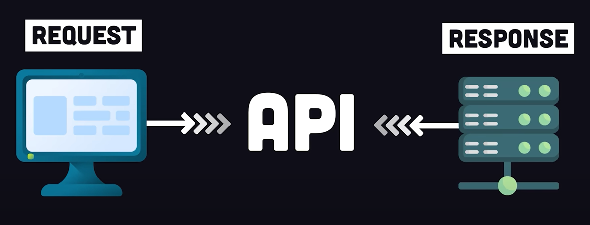

Using an API is just like using a website in your browser, but instead of clicking on buttons and filling out forms, you write code to explicitly request data from a server. 

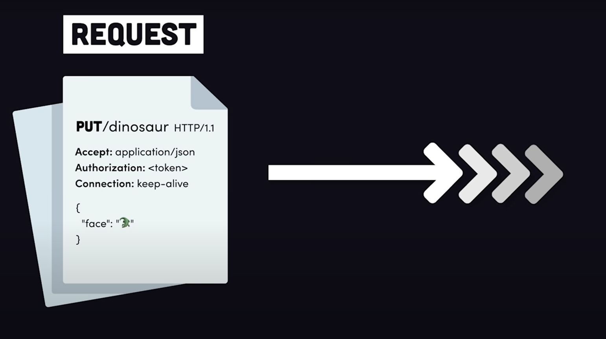

For example, we could visit the NASA website to look at asteroids, OR we could use their REST API to request the raw JSON data that's shown on the screen.

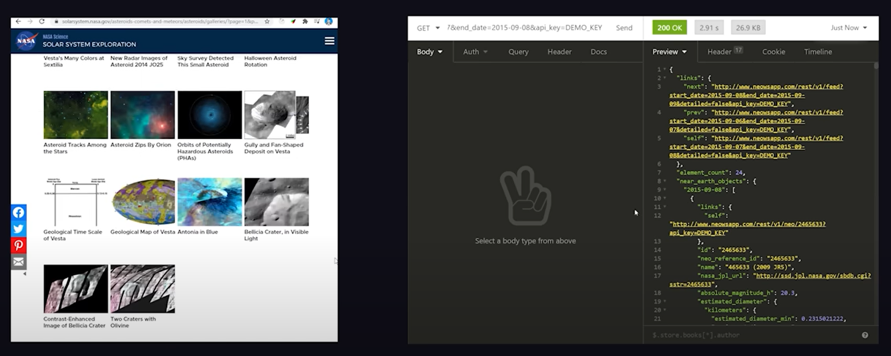

 

### Most APIs are RESTful

This means they follow a set of rules or constraints known as **Representational State Transfer**.

This has been the defacto standard for API development since the early 2000s.

A **RESTful API** organises data entities - or resources - into a bunch of unique URLs*

*technically these are not URLs, but rather **URIs** - **UNIFORM RESOURCE IDENTIFIERS**.

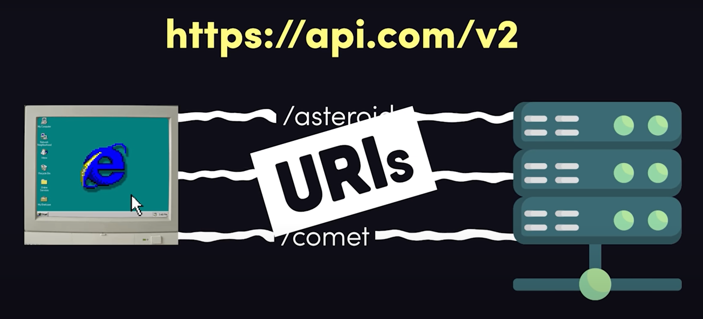

URIs differentiate different types of data resources on a server. 

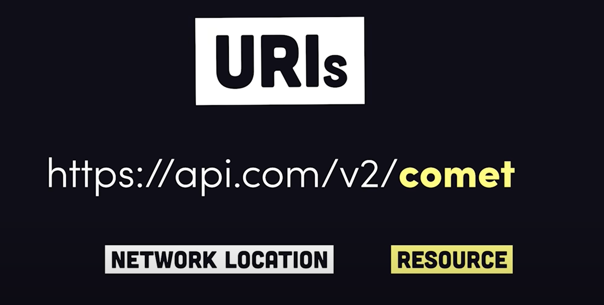

A client can get data about a resource by making a request to that endpoint over HTTP.

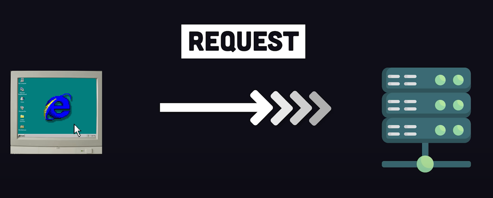

 

### The Start Line

The request message has a very specific format. 

Most importantly, the "start line" contains the URI that you wish to access. This is preceded by a HTTP verb / request method (such as POST, PUT, GET), which signals your intent with the resource.

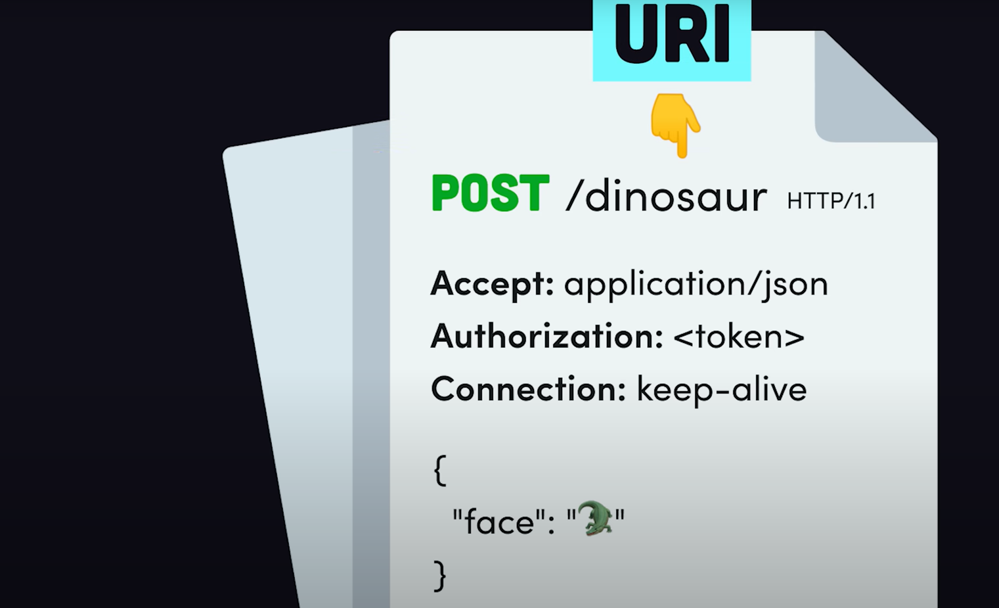

- `GET` = READ
- `PUT` = CREATE
- `PATCH` = UPDATE
- `DELETE` = DESTROY

There are also a few more HTTP methods beyond the main ones outlined above. 

 

### Headers

Beneath the start line we have headers, which contain meta data about the request. 

The **Accept** header can tell the server you want the data in a specific format. 

The **Authorization** header can be used to tell the server that you're actually allowed to make that request. 

 

### The Body

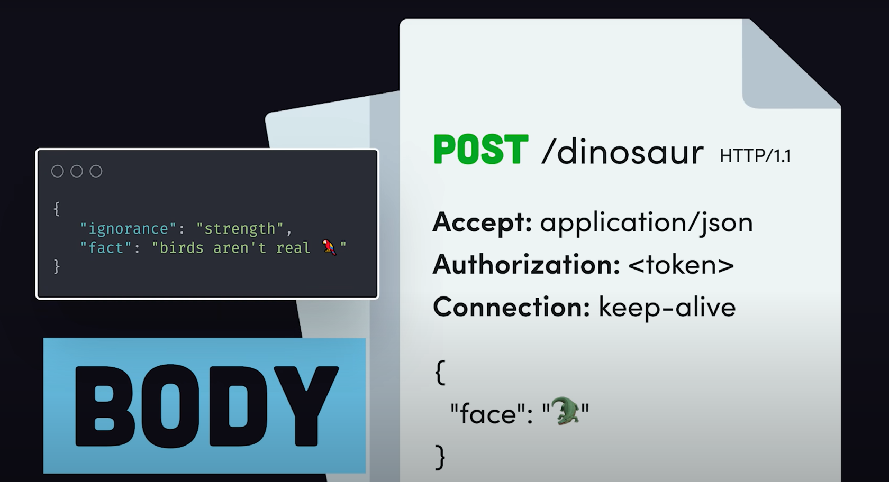

Beneath the headers we have the body, which contains a custom payload of data. 

The server will receive the request message, then execute some code (usually to read from a database), this is then formatted into a RESPONSE message.

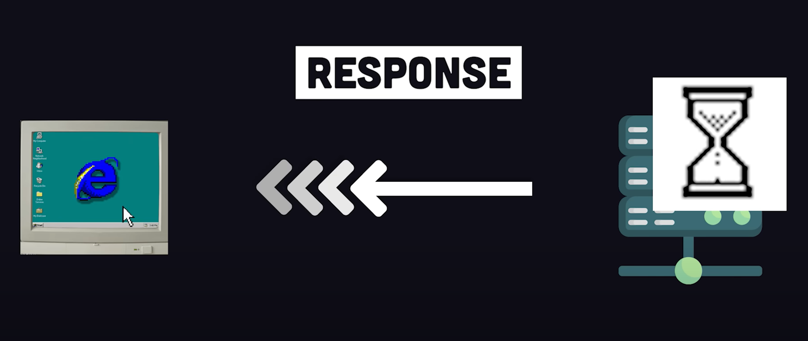

The top of the message contains a status code. This tells the client what happened to their request. 

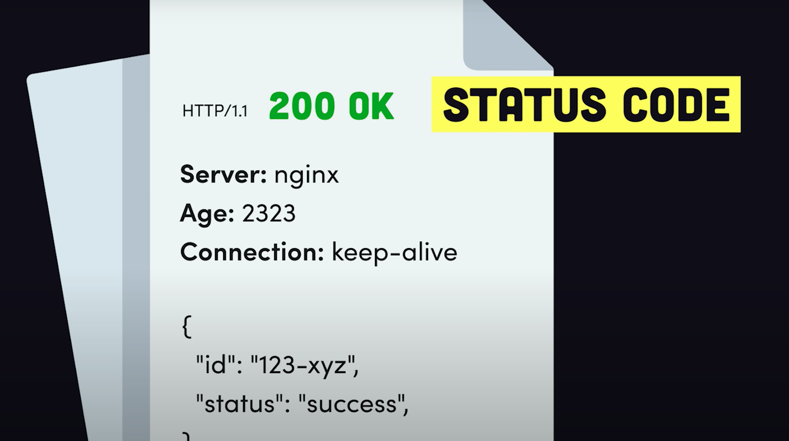

The first number in the code indicates...

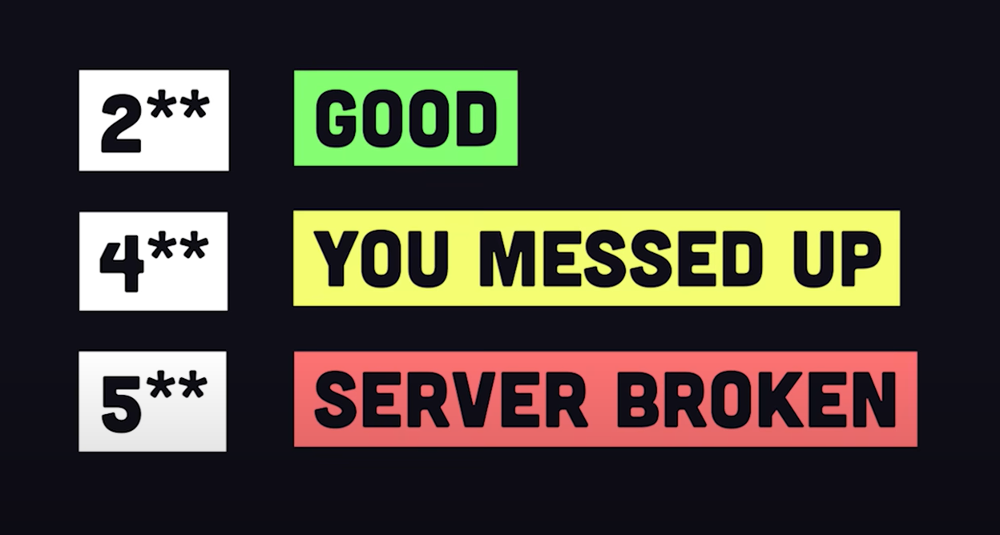

We then have the response headers and body.
The headers contain info about the server and the body contains the data payload and is usually formatted in JSON. 

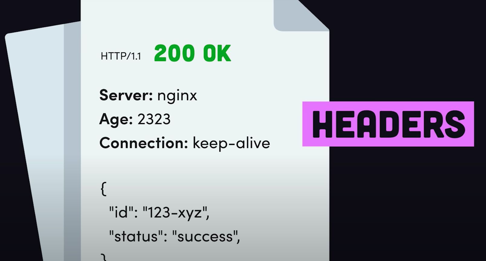

 

### Stateless Architecture

An important part of this architecture is that it's stateless.

This means that the two parties do not need to store any information about each other.

Every request/response cycle is independent from all other communication.  

This leads to well behaved web applications that are predictable and reliable. 