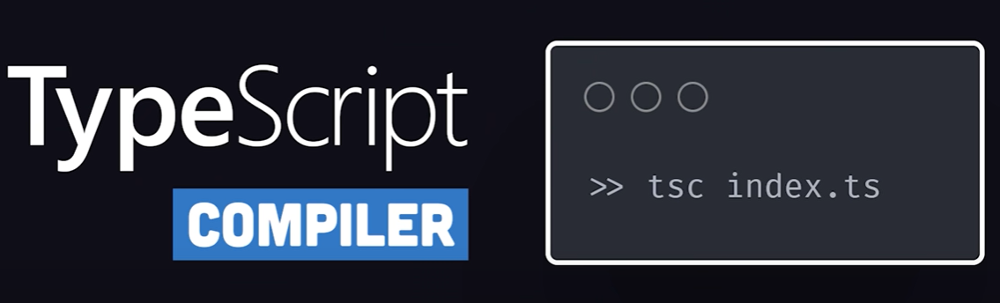

# TypeScript in 100 Seconds

JavaScript is a dynamic language that can do all sorts of crazy things! 

For example, it's possible to...

- Reference variables that *don't exist*
- Work with objects of an *unknown* shape


The code is interpreted by a browser, BUT if your code is broken, you won't catch the error until runtime, when the browser throws an error! 

<br>

### TS extends JS *with types*!

TypeScript prevents errors like this from ever happening, by extending JavaScript with **types**.

<br>

### Superset of JavaScript

The language is a strict **superset** of JavaScript, which means when you open a **TS** file you can write JS, with TypeScript syntax/features being completely optional.


<br>

### IDE provides feedback around types


In the above, the IDE has identified an issue within the TS file and notified us about it. By hovering over the issue, you see that `someObject` doesn't exist, which could cause problems at runtime! 

<br>

### TS behaves like a *compiled language*

The reason you get this instant feedback is because TS behaves like a compiled language, where JS is the compilation target.  

Run the TS compiler using the `tsc` terminal command.



This transpiles the target file into vanilla JS. Plus, you can choose any flavour of JS you want, if you need to target ancient browsers - ES1, ES3, ES5, ES6. 


This means you can use the latest and greatest syntax features of JS without having to worry if they'll be supported in an older environment.

<br>

### Use `tsconfig.json` to customise options

This file provides an infinite number of ways to customise the behaviour of the compiler.


<br>

### Primary goal of TS: *enable static typing*

One way to achieve that is to annotate your code with types.

You can **"strongly type"** a variable by adding a colon, followed by its type. This is called an **"explicit type"**...

```ts
// explicit types:
let appName: number;
let appName2: string;
let appName3: boolean;

// This would produce a warning - incorrect type
appName = "hello world";
```

<br>

### Implicit type inference

Alternatively, if we set an initial value when declaring the var, TS will *implicitly infer* the type...

```ts
// implicitly infered type - type = string
let name = "evan";
```

<br>

### `any` type

However, there may be cases where you want to opt out of this behaviour, in which case you can annotate with the `any` type...

```ts
let name: any = 'evan';
```

This allows you to **"loosely type"** - or opt-out - of type checking. 

<br>

### Arrays

When working with arrays, use square brackets to strongly type a list...

```ts
let list: number[] = [1, 2, 3];
```

<br>

### Custom types & interfaces

You can define your own custom types and interfaces, which is especially powerful when working with objects.

```ts
interface Car {
    year: number;
    model: string;
    electric: boolean;
}

let myCar: Car;
```

The car interface above defines various different types for the properties on an object. 

Can then apply this interface as the type of a plain JS object, `let myCar: Car;`

### Autocomplete everywhere

The beauty of strongly typed code is that you get autocomplete everywhere in our IDE, as seen below.

You don't have to read documentation or dig through stack traces to figure out why your code's not working.


