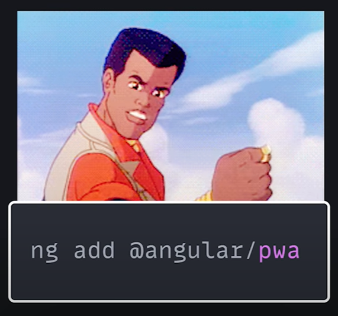

# Angular in 100s

Angular is a TypeScript framework for building UIs.

It was built by **Google** and released in 2016 as the sequel to **Angular JS**. 

To get started, use its hugely powerful CLI tool to generate your initial application.

When you do this, your app comes preconfigured with:

- routing
- a testing framework
- your fav style preprocessor

In addition, the `ng add` command can turn your app into a PWA (progressive web application), add SSR (server side rendering) and provide Firebase support!. 

 

### Components

At its core, Angular is just a component-based UI library.

You can create a component with the CLI...

If you then navigate to its TS file, you notice the component *decorator* - `@Component` - which makes this TypeScript class a component. 

Any properties on this class are considered reactive state, and when their values change the component will rerender the UI. 

 

For example, we can bind the property to HTML using double curly braces `{{ }}` in the template.

 

From there, we could add a button that increments the value each time the button's clicked. 

We add the event name on the left side and an expression on the right. This points to a method in our class. 

Each time the button is clicked, it calls the method, which changes the state, which triggers a rerender in the UI. 

  

Angular also has a variety of directives for building complex templates. 

You can use `ngIf` to handle conditional logic.

 

If you have an iterable value, use `ngFor` to loop over it. 

 

### Service

Where angular really excels is handling complexity, and one of its primary tools for doing so is called "Dependency injection". 

When your app grows to hundreds of components, you'll likely need a way to share data and functionality between them. 

We can take our component logic here and extract it into a service, which can be treated as a global singleton throughout the application. 

Now, any component that wants to use this state or logic, can simply add this class to its constructor. 

The end result is a simple and reliable way to compose comlex applications.

As a developer, you can always count on a consistent experience between projects - and minimal decision fatigue.