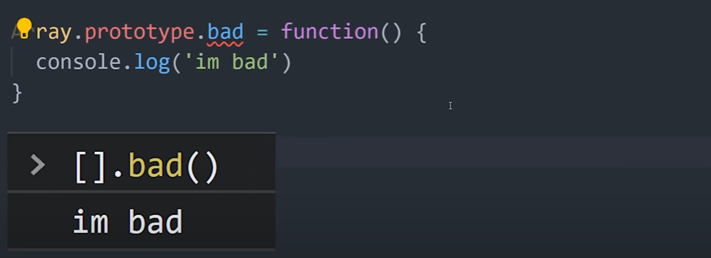

# 10 Design Patterns in 10 Minutes

This doc will focus on the following design patterns, along with their pros and cons...

### "Design Patterns - Elements of reusable Object-Oriented Software"

One of the most influential books in the history of programming is "Design Patterns"...

...written by 4 C++ engineers called "The Gang of Four"...

The book breaks down 23 different approaches to address recurring problems that programmers face, which are categorized as...

- **Creational Patterns:** how objects are created
- **Structural Patterns:** how objects relate to each other 
- **Behavioural Patterns:** how objects communicate with each other 

 

Becoming a proficient software engineer isn't about memorizing the syntax of a programming language, but rather the ability to solve problems with it.

 

**Additional Resources:** 

Refactoring Guru:
https://refactoring.guru/

- Excellent educational site with great graphics that explain design patterns - used throughout these notes

  

### Patterns are not algorithms

Design patterns are not just like algorithms that you can copy/paste from Stack Overflow or ChatGPT. You have to use thought and consideration to implement them correctly.  

Patterns are often confused with algorithms, because both concepts describe typical solutions to some known problems. While an algorithm always defines a clear set of actions that can achieve some goal, a pattern is a more high-level description of a solution. The code of the same pattern applied to two different programs may be different.

### Patterns are not a solution for everything...

It can be tempting to implement them everywhere, but when used improperly they can add unnecessary complexity and boilerplate to a codebase.

Important to note also that the "Design Patterns" book is not the bible - and many people have criticized it! 

Regardless, knowing how to recognize design patterns will help you level up as a programmer! 

  

## Pattern 1: **Singleton** 

**Singleton** is a type of object that can only be instantiated **ONCE**. 

In TS, we might implement a singleton class called "`Settings`", to represent the global app settings data. 

Give it a `static` `instance` property, and make its `constructor` `private`, so that it can't be instantiated with the `new` keyword.

We then create a `static` `getInstance()` method that will check to see if the instance has already been created, and if not it will create a new one. **This ensures that only one object with that name can be created.**

*But here's where things become a little more nuanced...* 

In JS we have **object literals** and also the concept of **global data**. And objects are passed around by reference. 

We get all the same basic characteristics of the **singleton** pattern by simply creating a global object. 

The pattern itself is really just extra boilerplate that we don't need.

It's an entirely different story in C++ - *different language, different story* - but the moral of the story is to lean on your language's built-in features before implementing a fancy design pattern. 

  

### Pattern 2: **Prototype** | AKA Clone

If you've done Object Oriented Programming (OOP), you'll be familiar with inheritance, where a `class` can be extended with a sub-class.

One problem with inheritance is that it can lead to a complex hierarchy of code. 

The prototype pattern is an alternative way to implement inheritance, but instead of inheriting functionality from a class it comes from an object that's already been created. 

This creates a flat prototype chain that makes it much easier to share functionality between objects, especially in a dynamic language like JS, which supports prototypal inheritance out of the box.

 

Imagine we have an `object` named `zombie` - this is the *prototype*.

Now we want to create a new `object` based on `zombie`, that also has a name. We can do that with `Object.create(zombie)` - this is the *clone*.

Can then pass additional properties to the clone, such as `name` etc.

 

The interesting thing is, if you `console.log(chad)`, you will only see the name, and not the `eatBrains()` method...

...however, if you try to call that method on `chad` **it will work**! 

That's because JS will go up the prototype chain until it reaches the root, looking for any methods or properties on the parent objects.

 

You can always get the prototype from an object using the `__proto__` property. However, that's not a modern best practice and instead you should use `Object.getPrototypeOf()`. 

 

### Classes in JS

When it comes to **classes** in JS, `prototype` refers to its `constructor`. 

That means we can extend a class with additional functions if we want to, however that's also generally considered bad practice. 

  

### Pattern 3: **Builder**

Imagine you're running a hot dog stand and when a customer places an order they need to tell you everything they want on the sandwich in a `constructor`.

 

 That works, but it's kind of hard to keep track of all these options and we may want to defer each step to a later point.

 With the **builder** pattern, we create the object step-by-step using `methods`, rather than the `constructor`. And we can even delegate the building logic to an entirely different class.

 

 In JS, we'd have each method return `this`, which is a reference to the object instance. 

 

 That allows us to implement method chaining, where we instantiate an object, then chain methods to it, but always get the object as the return value. 

 

 You'll come across this pattern frequently with libraries like jQuery - although its gone out of style in recent years! 

   

 ### Pattern 4: **Factory**

 

 

 With factory, instead of using the `new` keyword to instantiate an object, you use a function or a method to do it for you. 

 Let's imagine we're building a cross-platform app that runs on both iOS and Android. They both have the same interface, but in our code we're doing a bunch of conditional checking to determine which button to show. 

 

 That's not very maintainable! Instead, we can create a sub-class or function that will determine which object to instantiate. 

 Now, instead of repeating the same logic, we use the factory to determine which button should be rendered. 

 

 

  

 ### Pattern 5: **Facade**

 

 

 A facade is the face of a building. Inside that building there's all kinds of shenanigans, corruption and complexity that the end user doesn't need to know about. 
 
 In programming, a facade is basically just a simplified API to hide other low-level details in your code base. 

 Let's imagine we have classes for the plumbing system and electrical system. Inside of them we have all kinds of complex stuff going on - like pressure and voltage. 

The people living in the house don't need access to all these low-level details, so we create a *facade* class that contains the low-level systems as dependencies, but then simplifies their operation. 

We might combine all of the electrical and plumbing details into a single method...

...so that the end user can simply turn them on or off with a single method. 

Almost every package that you install with JavaScript could be considered a facade in some way, like **jQuery** is a great example of a facade for the more annoying, low-level JavaScript features.

 

### Pattern 6: **Proxy**

Proxy is just a fancy word for substitute. Like in school you might have a substitute teacher to replace the real thing. In programming, you can replace a target object with a proxy.

But why would you ever want to do that?

A great case study is the reactivity system in Vue.js

In Vue you create data, but the framework itself needs a way to intercept that data and update the UI whenever that data changes. 

The way Vue handles that is by replacing the original object with a proxy. 

A proxy takes the original object as the first argument, then a handler as the 2nd argument. Inside of which we can override methods like `get()` and `set()`, which allows us to run code whenever a property is accessed on the object, or changed. 

