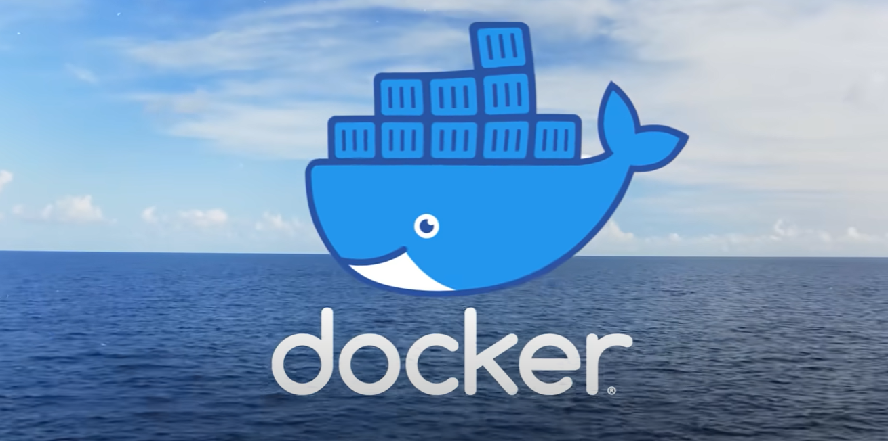
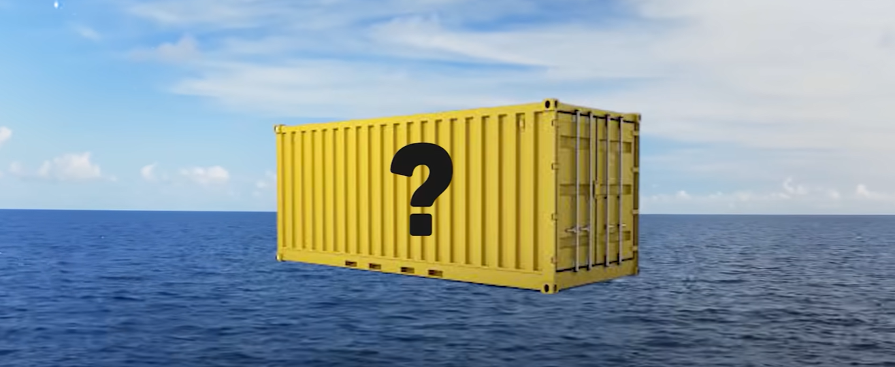
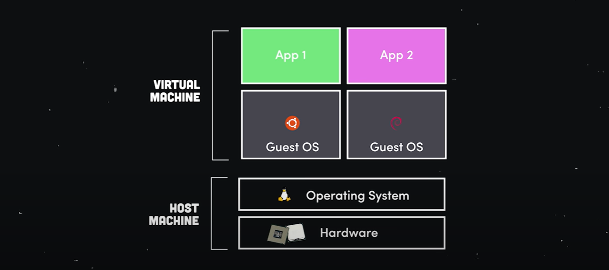
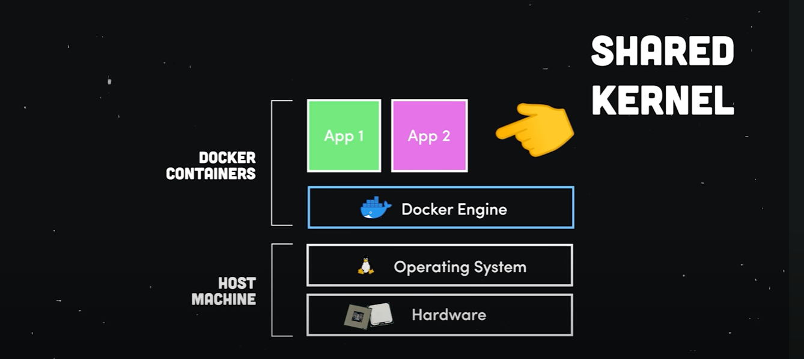
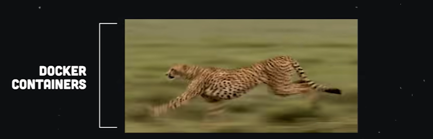
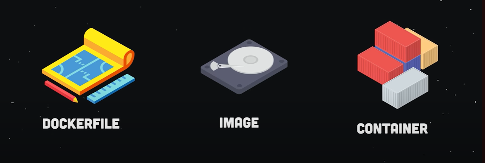
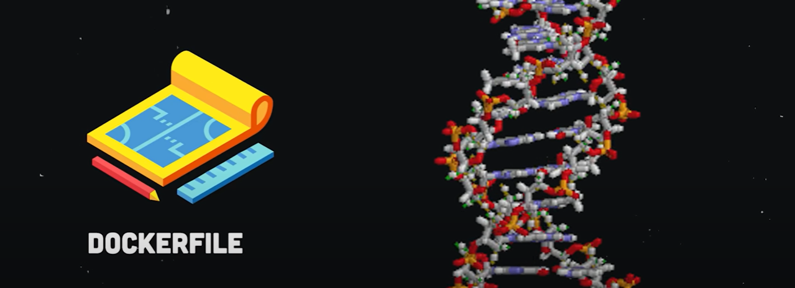
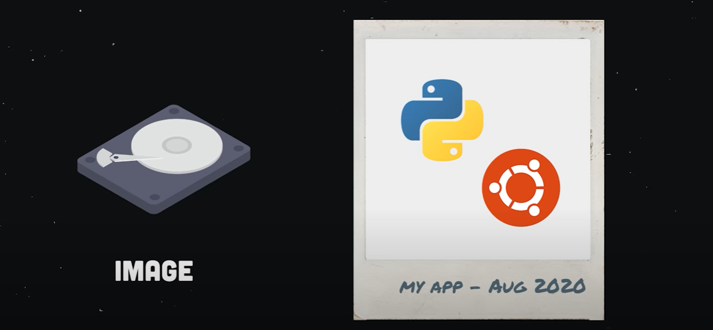
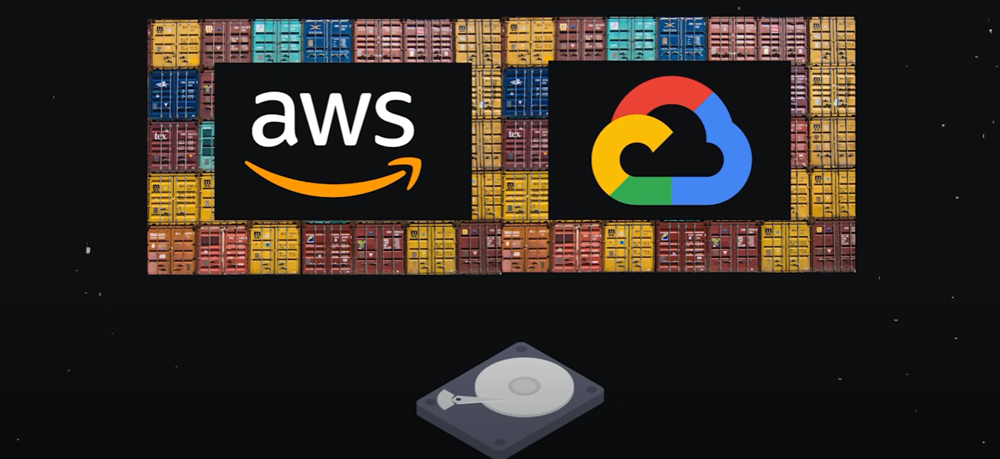

# Docker in 100s

Docker is a tool that can package software into containers that run reliably in any environment. 

**But what is a container and why do you need one?** 

Imagine you built an app with Cobol that runs on some weird flavour of linux. You want to share this app with your friend, but he has an entirely different system. 

**So, the problem becomes:** how do we replicate the environment our software needs on *any* machine?

One way to package an app is with a **virtual machine**, where the hardware is simulated, then installed with the required OS and dependencies. 

This approach allows you to run multiple apps on the same infrastructure, however because each vm is running its own operating system they tend to be bulky and slow - like an overweight cat trying to make its way through a small cat flap. 

 

### Docker container similar to a vm - but better! 

A docker container is conceptually very simiar to a vm - **with one key difference!** Instead of virtualizing hardware, containers *only virtualize the OS*. 

In other words, all apps or containers are run by a single kernel - and this makes everything faster and more efficient. 

  

### 3 fundamental elements in the Docker universe

#### Dockerfile

The dockerfile is like DNA. It's just code that tells docker how to build an image.

#### Image

An image in docker is just a snapshot of your software, along with all its dependencies - down to the OS level. 

#### Container

The image is **immutable**, and it can be used to spin up multiple containers, which is your actual software running in the real world. 

 

### Getting Started - FROM

Create a docker file and use `FROM` to start from an existing template like ubuntu. 

This base image gets pulled down from the cloud, and you can also upload your own images to a variety of different docker registries. 

 

### Getting Started - RUN

From there, you might want to use `RUN` to run a terminal command that installs dependencies into your image. 

 

### ENV Variables 

You can set environment variables and do all kinds of other stuff. 

### CMD 

The last thing you'll do is set a default command `CMD` that's executed when you start up a container.

 

### `docker build` command

Then you can create the image file, by running the `docker build` command. It goes through each step in our docker file to build the image layer by layer. 

### `docker run` command

We can then bring this image to life as a container with the `docker run` command. 

 

As your app demands more resources you can run it on multiple machines, multiple clouds, on-premises (installed on own hardware) - or wherever you want reliably. 

