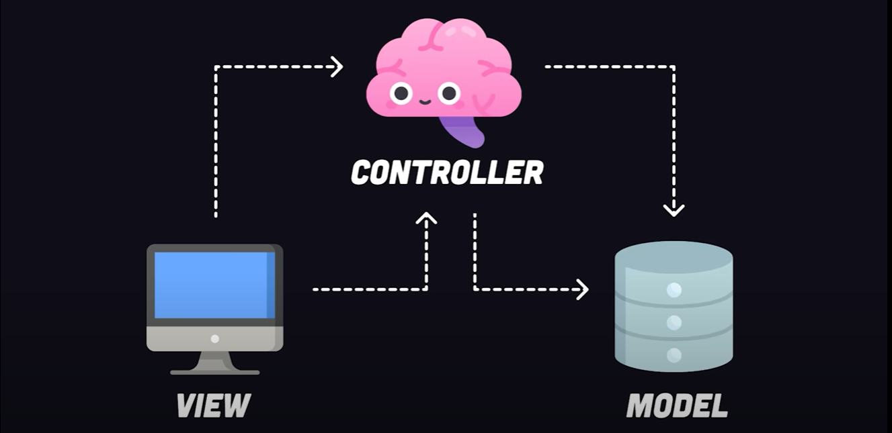
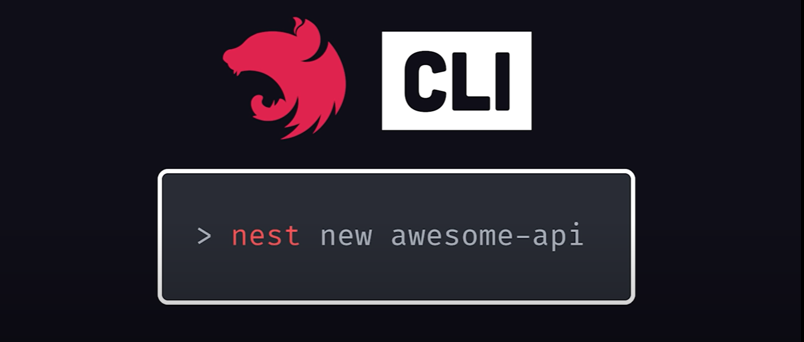
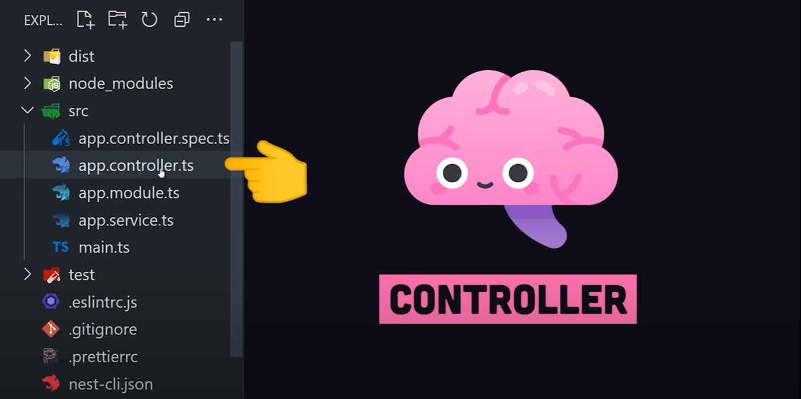
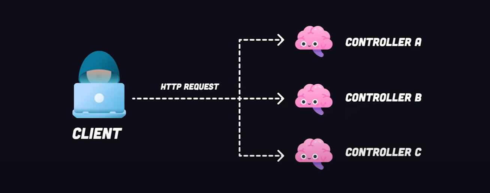

# Nest.js in 100 Seconds

**NestJS** is a node.js framework for building scalable, server-side applications with TypeScript. 

It provides a suite of tools that leverage either **Fastify** or **Express** to facilitate rapid development and predictable, readable code. 

It supports **REST** and **GraphQL** APIs out of the box.

Or, you might use it to build a full-stack application using the model view controller pattern - similar to frameworks like **Laravel** or **Ruby on Rails**.

NestJS contains a bunch of built-in modules to work with databases, handle security, implement streaming and anything else you can imagine doing in a server-side application...

  

### Powerful CLI

Nest has its very own powerful command line tool. 

You can scaffold out a new project with the `nest new` command.

This command provides a codebase pre-configured with **Jest** for testing, and set up with **TS** to help us create more readable and reliable code.

 

### Controller

In the `src` directory, you'll notice a "controller", which is a fundamental building block of the framework.

It's responsible for handling incoming HTTP requests and returning responses back to the client. 

Continue from 55 seconds....