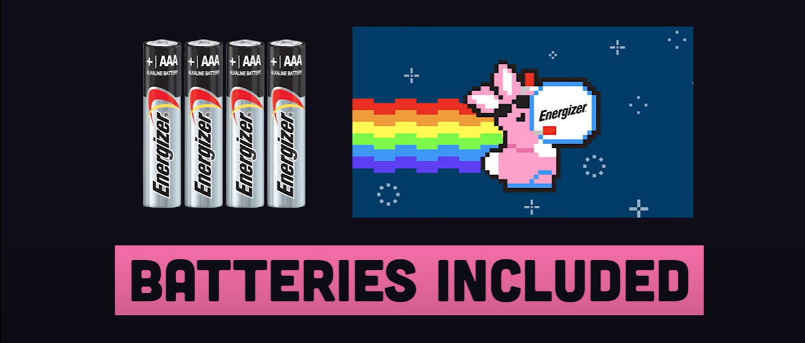
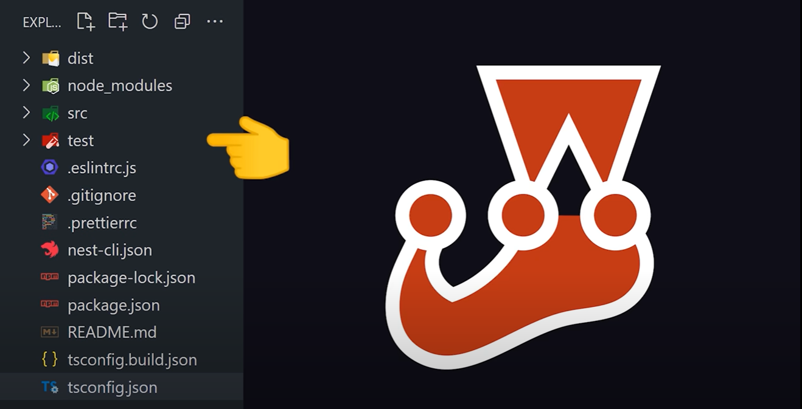
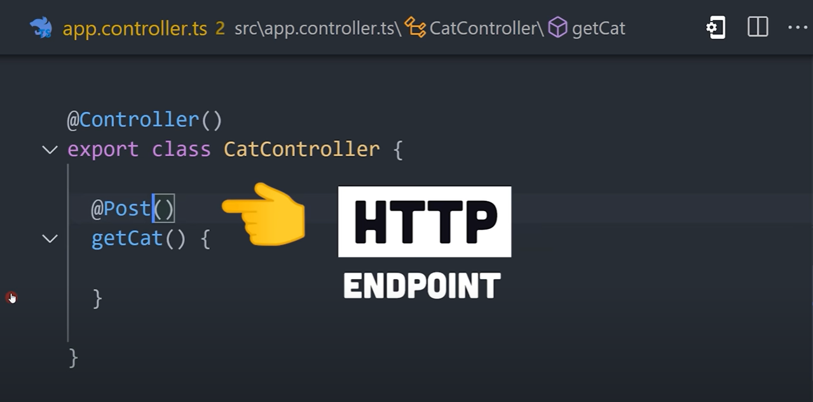

# Nest.js in 100 Seconds

**NestJS** is a **Node.js** framework for building scalable, server-side applications with TypeScript. 

It provides a suite of tools that leverage either **Fastify** or **Express** to facilitate rapid development and predictable, readable code. 

It supports **REST** and **GraphQL** APIs out of the box.

Or, you might use it to build a full-stack application using the model view controller pattern - similar to frameworks like **Laravel** or **Ruby on Rails**.

NestJS contains a bunch of built-in modules to work with databases, handle security, implement streaming and anything else you can imagine doing in a server-side application...

  

### Powerful CLI

Nest has its very own powerful command line tool. 

You can scaffold out a new project with the `nest new` command.

This command provides a codebase pre-configured with **Jest** for testing, and set up with **TS** to help us create more readable and reliable code.

 

### Controller

In the `src` directory, you'll notice a "controller", which is a fundamental building block of the framework.

It's responsible for **handling incoming HTTP requests** and **returning responses back to the client.** 

To implement a controller, simply add the `@Controller` decorator to a class. Then, inside the class, you can implement methods and decorate them with **HTTP verbs** like: 

- `@Get`
- `@Put`
- `@Post`
- `@Patch`

 

By default, this will create a HTTP endpoint on the root URL, but you can also pass a **string** to the decorator to change the route, or implement dynamic route parameters:

In addition, nestJS provides other decorators to control things like the **status code** and **headers**:

Then in the method itself, parameter decorators can be used to access the **request** parameters or body:

Finally, the return value from the method is the response **body** that gets sent back down to the client:

  

### Generate more controllers with the CLI

What's awesome about nest is that you can use the CLI to automatically generate more controllers - to keep your code organized as it grows in complexity. 

  

### NestJS Providers

There's more to Nest than just controllers. A *provider* is `class` that contains shared logic throughout the entire application - and can be injected as a dependency where needed.

Any class with the `@injectable` decorator can be injected in the constructor of another class.

For example, a provider can be implemented as a guard to handle role-based user authentication. 

Or, it might be implemented as a pipe to efficiently validate and transform values in a controller. 

  

### The `@Module` decorator

Lastly, we have the `@Module` decorator, which allows code to be organized into smaller chunks, where it can be lazy-loaded to run faster in serverless environments.

