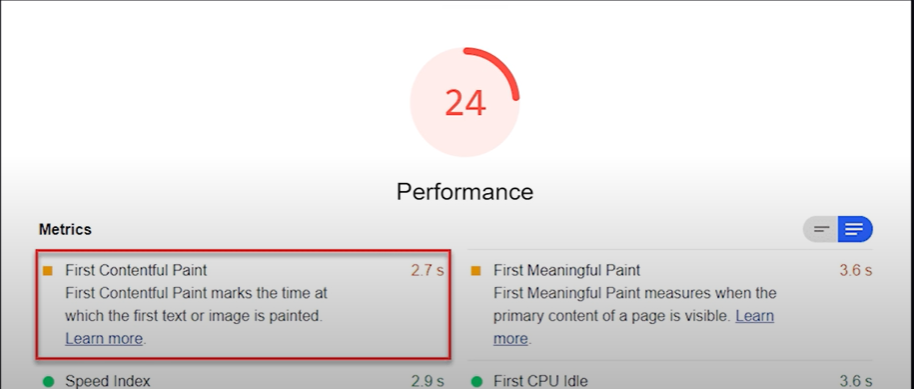
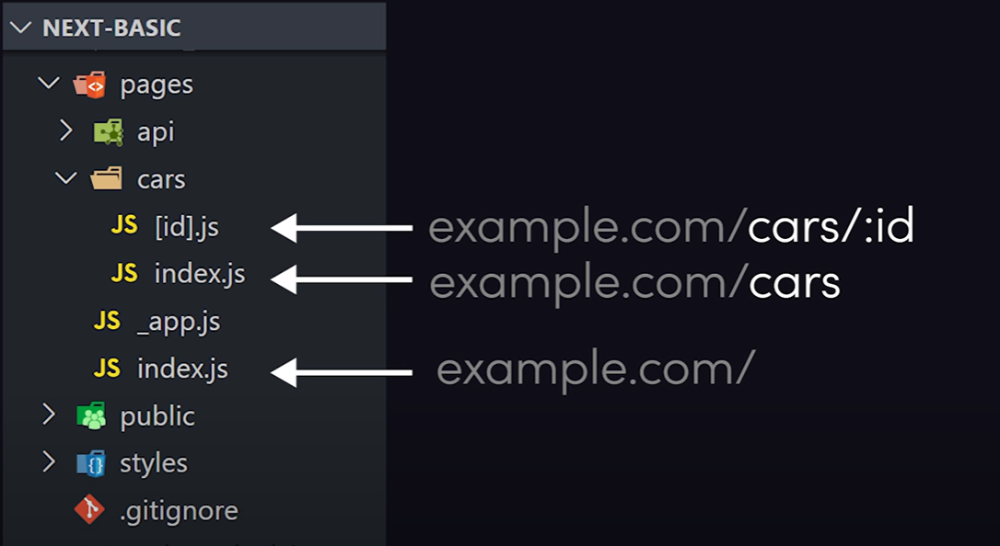
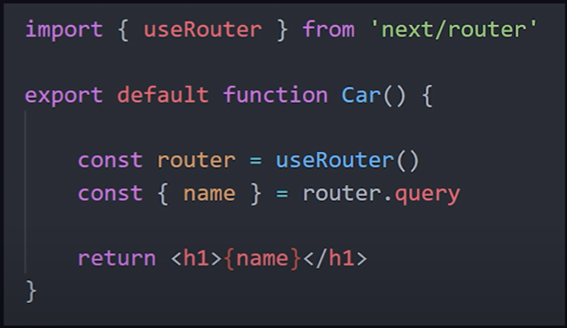
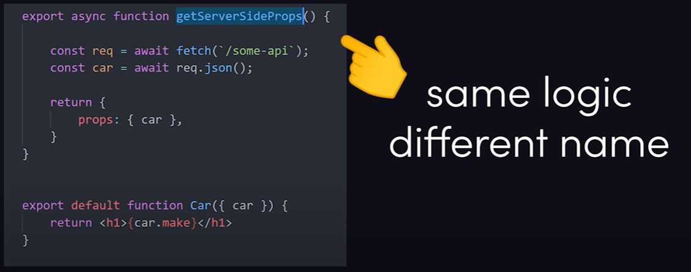
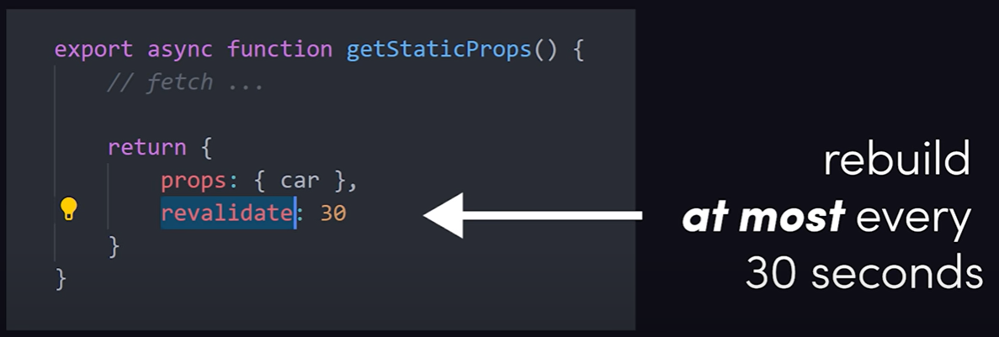

# Welcome to the course

**Next.js** is a React framework for building server-side rendered applications, as well as statically generated websites.

It offers powerful capabilities for building highly SEO-friendly websites easily.

This course is a project-based learning course, building a real estate / property search website. 

**Next.js** is a **META FRAMEWORK** - *a framework within a framework*.

 

### Overview of Next.js from Fireship...

Traditional React apps are rendered on the client-side.

With CSR in React...

- The browser starts with a shell of a HTML page
- This initial HTML page lacks any rendered content
- From there the browser fetches the JS file that contains the React code
- This process renders content to the page and makes it interactive

#### 2 major drawbacks of using CSR in this way...

1. **Content is invisible to BOTS**

- The content is not reliably indexed by all search engines
- Or read by social media link bots

2. **SLOWER to First Contentful Paint - FCP**

- When a user first lands on the web page, it can take longer to reach the "First Contentful Paint"

 

### Solution: Next.js

**Next.js** is a framework that allows you to build a React App, but it... 

- Renders the content in advance on the server
- So the first thing a user - or searchbot - sees is the fully rendered HTML

After receiving this fully-rendered page... 

- Client-side rendering takes over and everything works just like a traditional React app

### It's the best of both worlds...

- Fully-rendered content for bots
- Highly-interactive content for users 

  

### Next.js file structure

Within a Next.js project, you have a `pages` directory. Each js file defined here exports a React component that represents a route in the application. 

In other words, the file structure here mirrors the actual URLs that the user will navigate to.

Next provides its own router to make navigation seamless...

 

### The Real Magic = Data fetching

Next.js can perform multiple server-rendering strategies from a single project.

#### Static Generation (SSG): 

Render *all pages* at **build** time

- Allows you to pre-render your pages at *build* time
- Each page/component can implement a function called `getStaticProps()`
- This could fetch data from a cloud database and return it
- Then pass the data as `props` to the component

- Can then build the app - `npm run build` - to render out all the HTML files locally
- Then upload it to a storage bucket, where it can be easily cached by a content delivery network (CDN)

This process works great for a blog - or any kind of app where the data doesn't change often. But... if the data does change often, you could implement server side rendering (SSR)...

 

#### Server-Side Rendering (SSR):

generate *each page* at **request** time

- builds the HTML page each time it's requested by the user
- In the component, implement data fetching with the `getServerSideProps()` function
- Instead of running at build time, this function runs at *request time*

- This means the page will fetch the latest data on the server each time a *new request* comes in
- The HTML files are fully built/generated on the server-side, and then served to the client

This works great for pages that contain rapidly changing data, but you might want to use something inbetween, such as ISR...

 

#### Incremental Static Regeneration:

re-generate *single pages* in the **background**

- by simply adding a `revalidate` option to `getStaticProps()`, Next.js can regenerate a page whenever a new request comes in for it, within a certain time interval

When a page with the `revalidate` option is requested: 

- If the static HTML is **still valid (within the revalidate time)**, the already-built HTML file is served directly
- If the static HTML has **expired (past the revalidate time)**:  
  - the expired HTML is served immediately to the user
  - **In the background**, Next.js generates a new static HTML file using `getStaticProps()` and updates the cached version for subsequent requests

**First request:** 
- After the initial build, the first request serves the statically generated page

**Subsequent requests:**
- If a request comes within 30 seconds of the last build, the cached HTML is served
- If a request comes after 30 seconds, the existing page is served, and a rebuild is triggered in the background

Regeneration is only triggered on demand: ie when a request comes in after the `revalidate` period.

