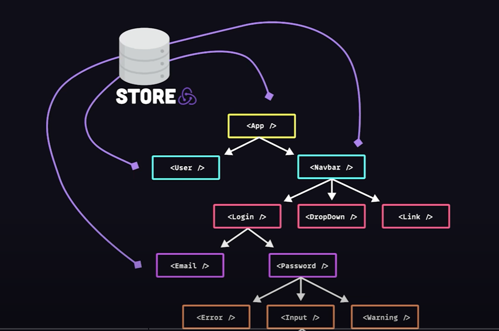

# Redux in 100s

Redux is a single source of truth for all of the data within React applications.

Redux is "framework agnostic", meaning it can be used with other frameworks than React - but React is the framework that uses it most. 

Modern web applications are represented as a complex tree of components. Components that constantly produce and share data called **state**.

When state is decentralized it can be difficult to understand and test. **This is where Redux comes in.**

 

### Redux overview

Redux is both a pattern and library that helps developers implement complex state management requirements at scale...

 

It relies on a single immutable object to store all of the application's state - kind of like a client-side database. 

To change the state, such as when a button is clicked, an **action** is dispatched.

The action has a **name** and a **payload** with the data that it wants to change. 

 

Remember, *the store is immutable*, so to change the state of the application an entirely new object is created by passing the current state and the action payload into a *reducer* function...

This returns a new object with the *entire application's state* - replacing the existing data in the store entirely, *instead of mutating it.*

The end result is a one-way data flow that's predictable and testable.

It also opens the door to awesome DevTools that allow you to time-travel through your application's data:

### The downside...

It comes at the expense of additional boilerplate code that may add too much complexity to a smaller project. However, Redux Toolkit significantly reduces this boilerplate now, making it easier to manage state even in smaller projects.

 

### Getting started

1. Create a react app and install the redux toolkit.

Redux Toolkit is now the recommended way to write Redux logic. It simplifies many of the common tasks and reduces boilerplate. 

1. Create the store

- use `configureStore()` to set up the global store object
- This will register any reducers to find elsewhere in the code

- Then `<Provider>` will make its data available to the *entire* component tree

 

### `createSlice`

3. Define reducer logic

Next, create a "slice" to represent some data in the store.

It should have a unique name and initial state, but most importantly it contains a collection of **reducers**, which are functions that take the old state and an action, then define the logic required to change/update the state.

Redux reducers are conceptually similar to the setter functions provided by `useState`.

 

Redux toolkit will automatically generate actions that correspond to the names of these reducer functions...

We can export them, then put them to use in an actual UI component...

 

### `useSelector`

4. Select state

The beauty of Redux is that you can select data anywhere in your application without the need for context or prop drilling. 

Instead, you can grab any reactive value or slice within the store with the `useSelector` hook.

 

### `useDispatch`

5. Dispatch actions

To change the application's data, an action needs to be dispatched to the store.

This can be accomplished with the `useDispatch` hook, which might send an action name and data payload on a normal browser event such as a button click.

 

### Redux DevTools browser extension

Serve your application and install the Redux DevTools browser extension. 

Unlike a normal project, you're able to inspect and debug the entire timeline of actions and state changes in your application. 

Redux DevTools can also be used without the extension by integrating it directly into the application code, which is useful for environments where extensions can't be installed.

