# Sass in 100s

Sass = Syntactically Awesome Stylesheets

Sass is a language that can *extend* your CSS - with superpowers. 

Modern UIs are extremely complex, rendering CSS hard to do. If you attempt to build a UI using plain CSS you will find that you repeat yourself often.

Sass comes to the rescue by providing a compiler that allows us to write stylesheets in a completely different language - **two** different languages to be exact.

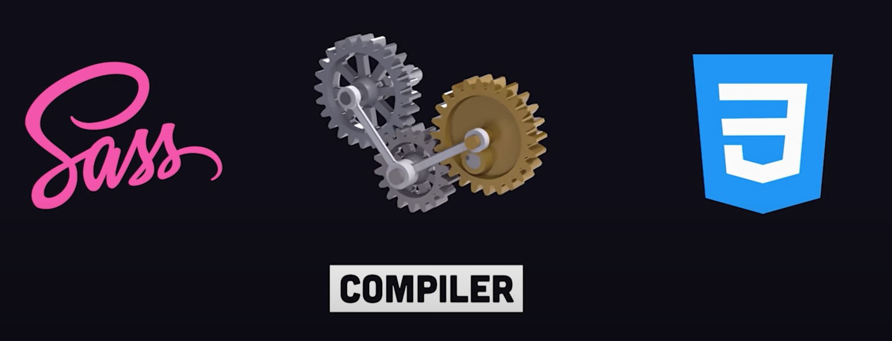

 

The original indented syntax that you find in `.sass` files removes the **syntactic salt** of semicolons and curly braces `{}`, `;`.

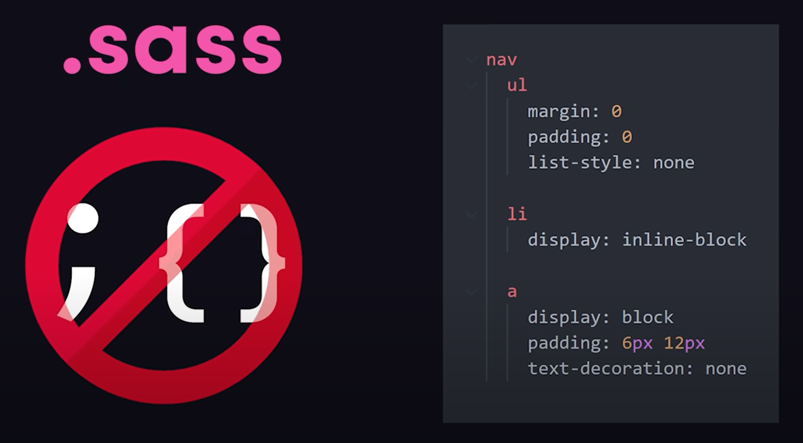

 

However... the *more popular* version is the superset syntax that you find in `.scss` files.   

Here you can write regular CSS, then extend it with bonus features as required! 

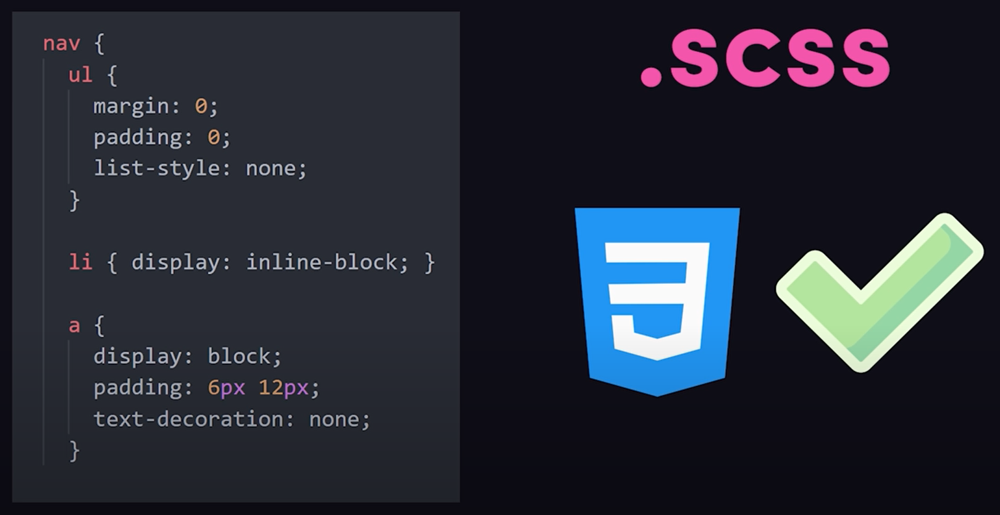

 

### Variables

Sass has been around since 2006. One of its original killer features was **variables**.

Use a `$` to create a variable, then reference it somewhere else in your code: 

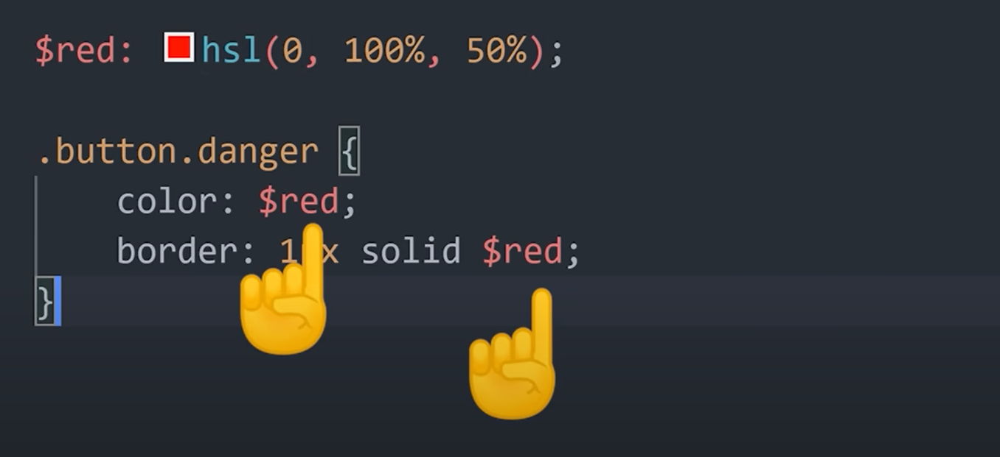

Now, if that value ever changes you only have to update *one line of code*!

CSS introduced its own native variables a few years ago, but the advantages of using SASS don't end with variables! 

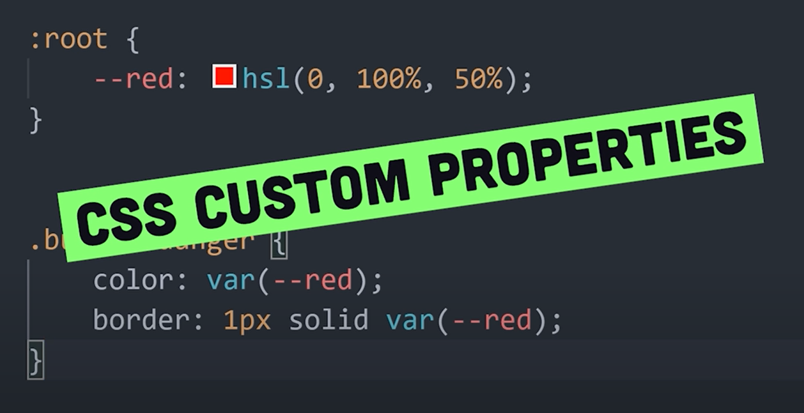

 

### SASS Nesting

Killer feature number 2 is **nesting**. In many cases classes are used as namespaces, which means they're often duplicated over and over again. 

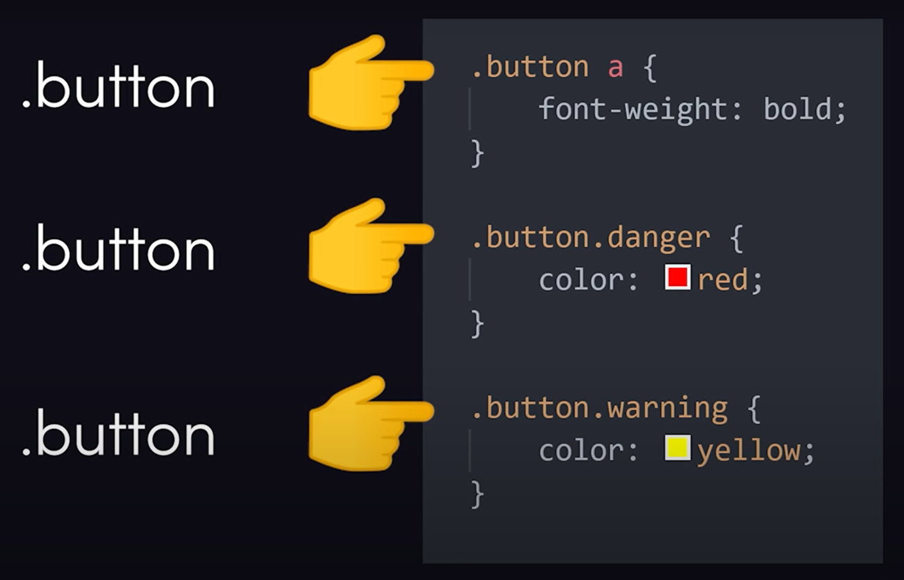

We can avoid this duplication by nesting styles inside the parent...

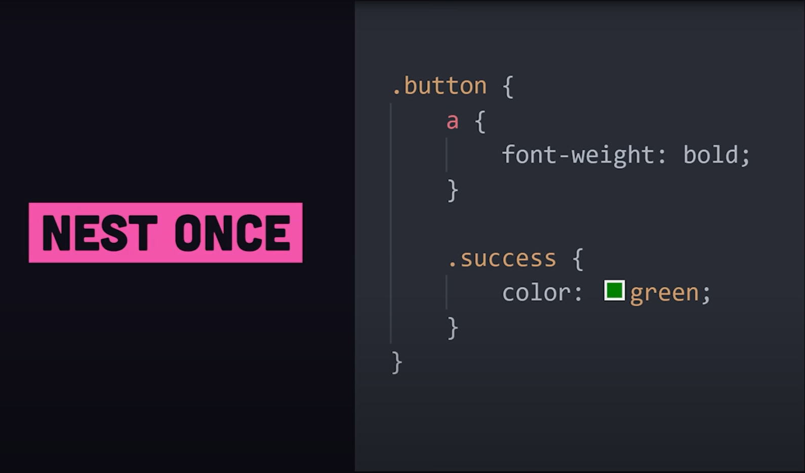

 

By default these classes will apply to descendent elements, or they can be applied to a direct sibling by using the ampersand `&`, which itself is a tool that tells SASS to combine the parent selector with the nested child selector. 

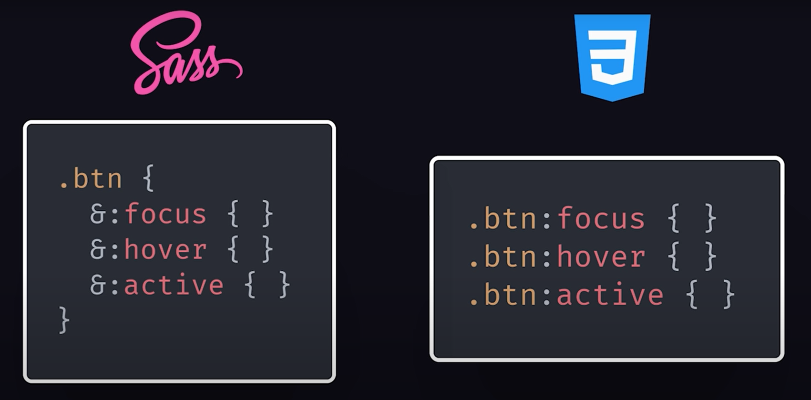

 

### Mixins

One other issue with vanilla CSS is that you'll find yourself using a similar group of styles over and over again on multiple different classes.

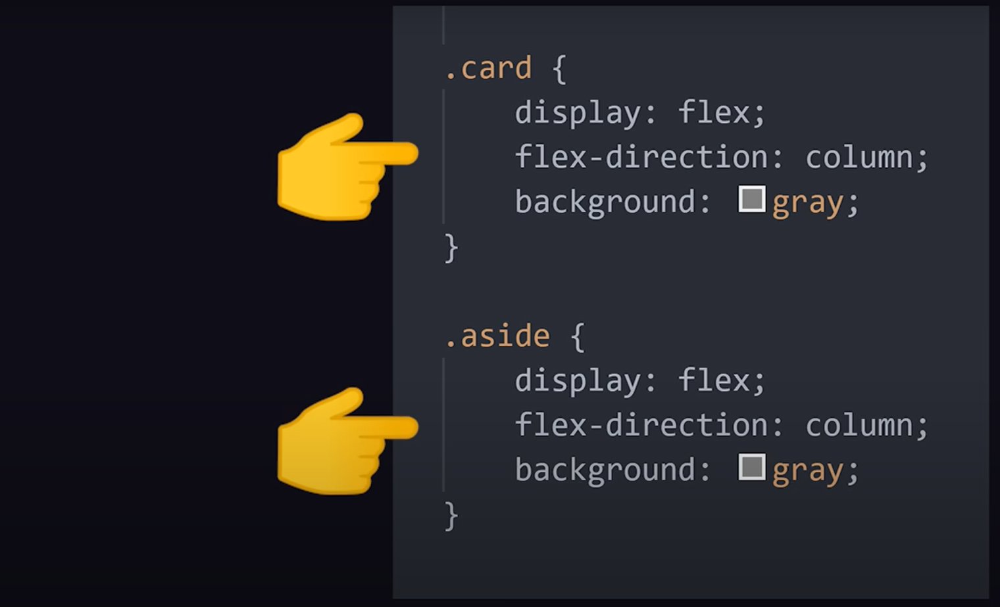

Mixins allow you to encapsulate a group of styles, then apply those styles anywhere within your code using the `include` keyword.

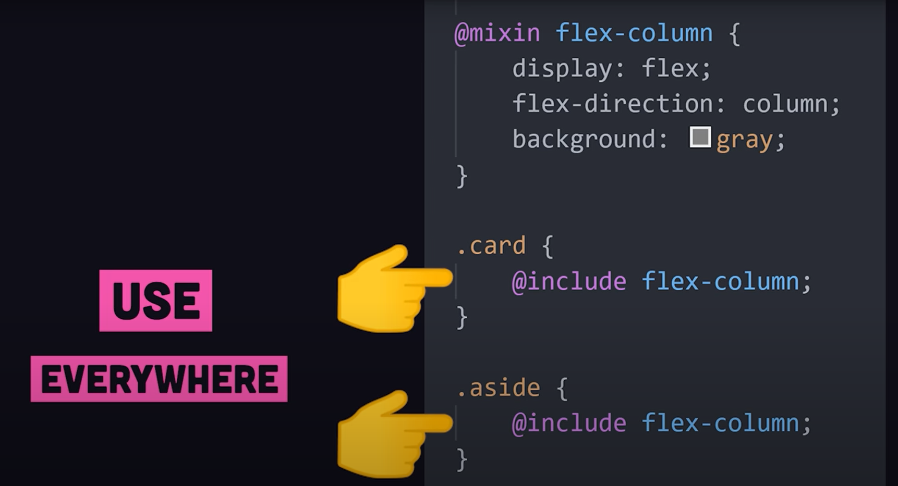

Mixins can also take *arguments* to create a large number of similar classes programmatically - for a group of different coloured buttons for example. 

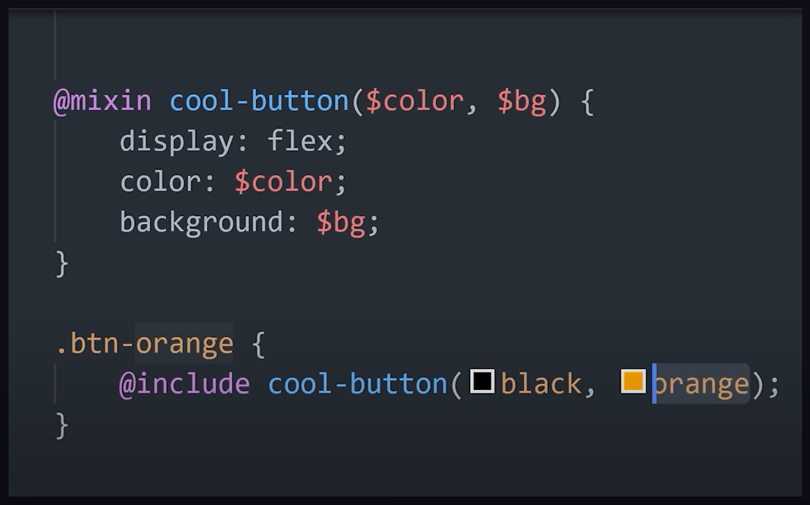

 

### Functions

In addition, Sass provides a whole suite of tools to help you write more programmatic code. 

You can use `@if` or `@else` in a mixin for more conditional logic:

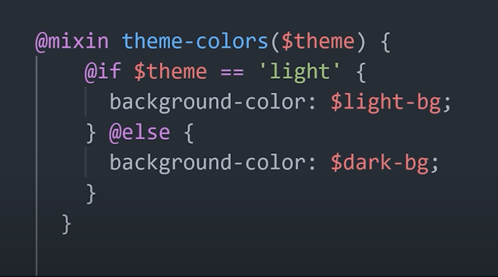

 

### `arrays` and `@each`

You could also create an **array** of values with a variable, then loop over them with `@each`.

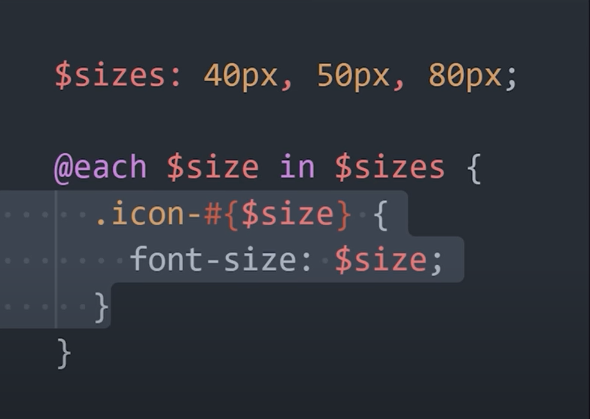

 

You may also extract all of this logic and create a **reusable function**.

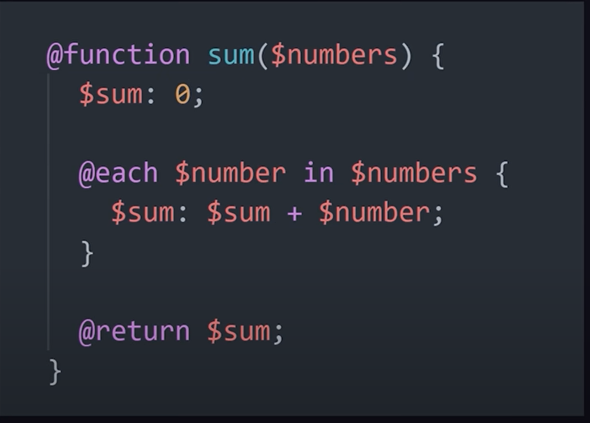

 

OR... Sass might already have a built-in function ready to go. For example, if you need to adjust a colour based on a predictable value, you could use the built-in `lighten()` / `darken()` functions.

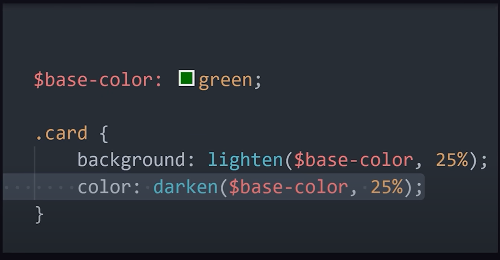

 

When you're finished building a beautiful UI, the compiler will take you code and convert it into valid CSS that can run in the browser. 

 

### CSS Preprocessors: CSS, Less and Stylus

CSS preprocessors like Sass, Less, and Stylus offer several key benefits that enhance the development process and improve the maintainability of CSS code. Here are some of the main advantages:

1. **Variables**: Preprocessors allow you to use variables to store values such as colors, fonts, or any CSS value. This makes it easier to maintain and update styles across a project.

2. **Nesting**: They enable nesting of CSS selectors in a way that follows the same visual hierarchy of HTML, making the code more readable and organized.

3. **Mixins**: Mixins are reusable pieces of code that can be included in other selectors. This helps in reducing redundancy and keeping the code DRY (Don't Repeat Yourself).

4. **Inheritance**: Preprocessors allow you to extend existing styles, which helps in creating a base style that can be reused and modified as needed.

5. **Mathematical Operations**: They support mathematical operations, allowing you to perform calculations directly within your CSS, which can be useful for responsive design and other dynamic styling needs.

6. **Functions**: Preprocessors come with built-in functions for color manipulation, unit conversion, and more, which can simplify complex styling tasks.

7. **Modularity**: They support splitting CSS into multiple files, which can be imported into a main stylesheet. This modular approach makes it easier to manage large projects.

 

Now, let's look at the differences between Sass, Less, and Stylus:

 

**Sass (Syntactically Awesome Style Sheets)**:

**Syntax:** Sass offers two syntaxes: the original indented syntax (similar to Haml) and SCSS (Sassy CSS), which is more like standard CSS.

**Features:** Sass is known for its powerful features, including advanced functions and control directives like `@if`, `@for`, `@each`, and `@while`.

**Community and Ecosystem:** Sass has a large community and a rich ecosystem of tools and frameworks, such as Compass.

 

**Less:**

**Syntax:** Less syntax is very similar to CSS, which makes it easier for beginners to learn.

**Features:** It supports variables, nesting, mixins, and functions. However, it is generally considered to have fewer advanced features compared to Sass.

**Integration:** Less can be compiled on the client-side using JavaScript, which can be convenient for quick testing but is less common in production environments.

 

**Stylus:**

**Syntax:** Stylus offers a very flexible syntax, allowing for both a concise, whitespace-sensitive style and a more traditional CSS-like syntax.

**Features:** It provides powerful features like mixins, functions, and the ability to omit semicolons, colons, and braces, which can lead to very clean and minimal code.

**Flexibility:** Stylus is known for its flexibility and expressiveness, allowing developers to write CSS in a way that suits their preferences.
Each preprocessor has its strengths and is chosen based on the specific needs of a project and the preferences of the development team.

 

In summary, Sass offers two syntaxes (indented and SCSS) and is known for its powerful features and large ecosystem; Less has a syntax similar to CSS, making it beginner-friendly, and can be compiled client-side; Stylus provides a highly flexible syntax with optional semicolons, colons, and braces, allowing for very concise code. Each preprocessor has unique strengths suited to different project needs and developer preferences.

