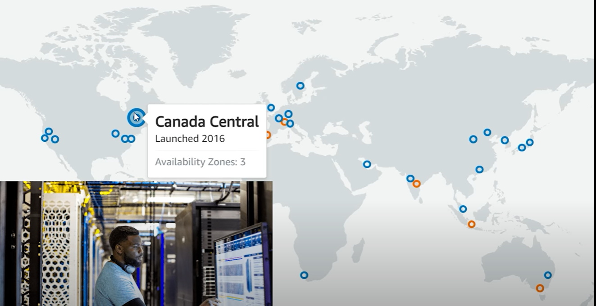
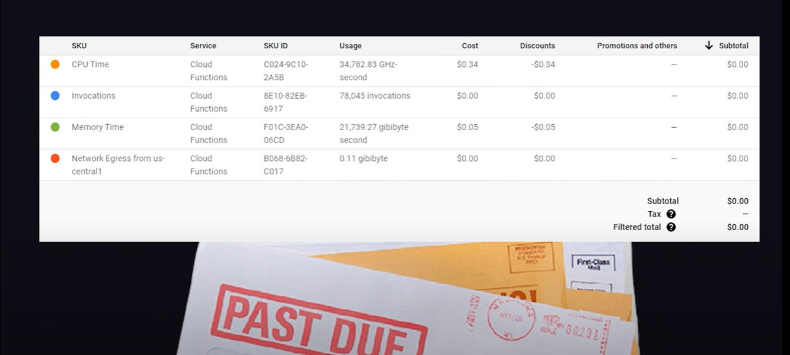
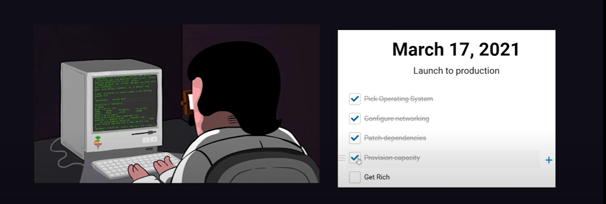
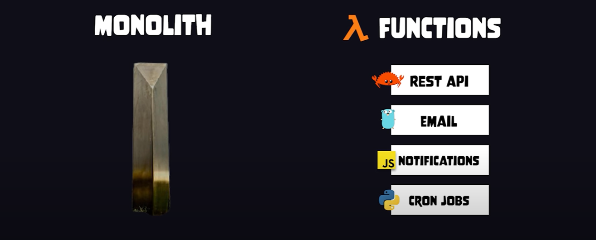
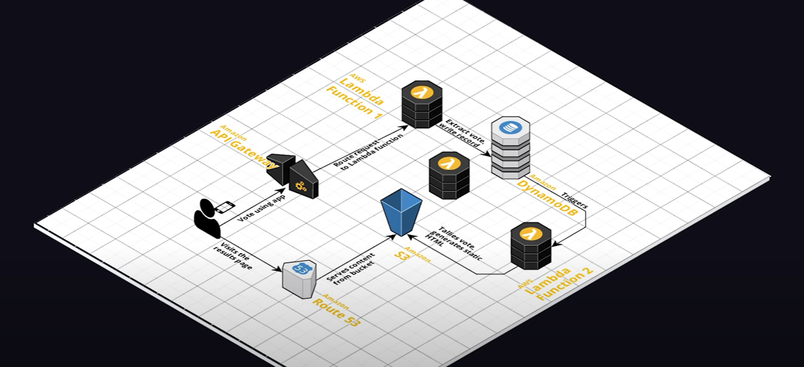
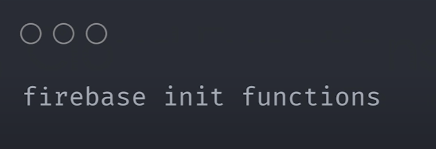
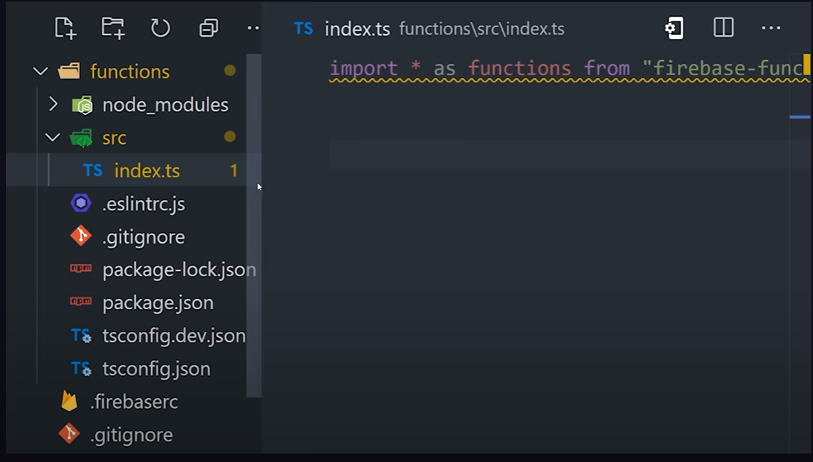
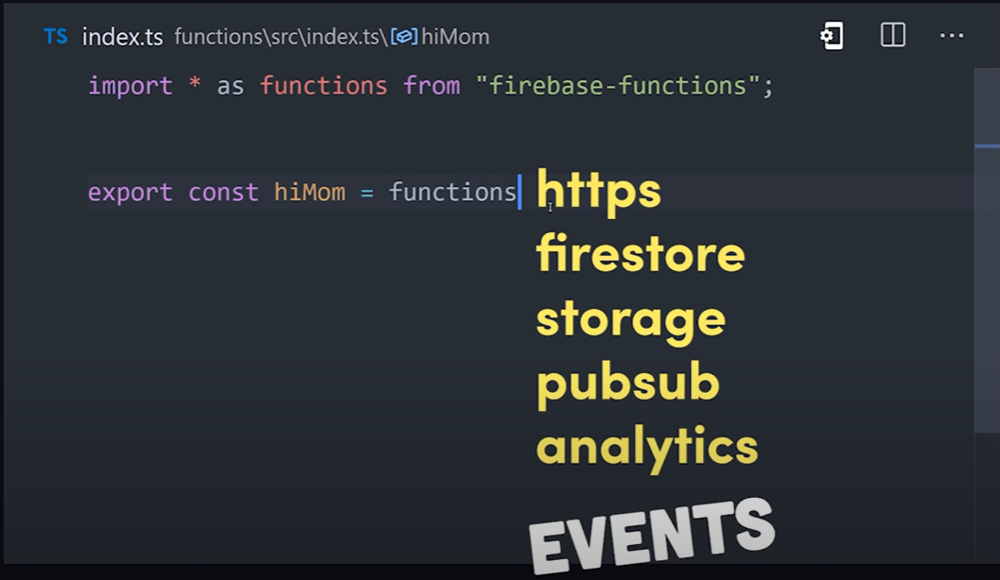
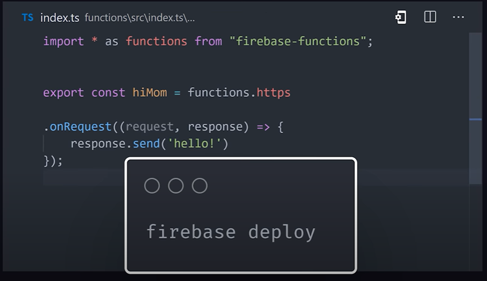

# Serverless Computing in 100s

"Serverless Computing" is a misnomer used to describe servers in the cloud that require zero configuration or maintenance from the developer.

 

### It's like tapping into your city's water supply

Imagine you need water for your house. You could spend a bunch of time and money digging a well, testing the water quality and plumbing it to your house...

...OR you could just tap into the city's water supply and pay a monthly fee based on the amount of water that you use. 

Serverless computing is *the exact same idea*, but instead of water, we're talking about... **the amount of CPU and Memory it takes to run your code!!!**

  

### Service Providers

Services like...

- **AWS Lambda**
- **Google cloud functions**
- **Azure functions**

...allow you to run your *back end* code across their global data centers.  

Then, they mail you a bill at the end of the month that's factored down to the millisecond. 

 

### Simplifies business concerns 

With serverless computing, your only concern now is writing code.

You **no longer** need to: 

- Pick an operating system
- Configure networking 
- Patch dependencies 
- Provision capacity

You can now just focus on *getting rich* as the cloud handles all of the above behind the scenes! 

 

### Architecture

From an architectural standpoint, it allows you to develop and test each business requirement independent of a bigger, **monolithic** system. 

 

### Serverless Functions

Not only do serverless functions make servers easier to manage, but they can also be executed based on different events that happen in the cloud, which can actually simplify your back end code.

For example, you might create a new database record when a user places an order, which then triggers a serverless function to send an email confirmation. 

Or maybe an IoT event on a home security system invokes a function that sends a push notification to the user's device.   

  

### Firebase Cloud Functions

One of the easiest ways to get started with serverless is Firebase cloud functions. 

The command line tool creates a project that looks like any other **Node.js** back end.

In the code, we can export named functions that are configured to run on different events that happen in Google cloud.

An event could be a simple HTTP request, or a file upload, database write, analytics event, and so on.

After writing our code, we can then deploy it to production with a single command - `firebase deploy`. 

And we now have a reliable back end that's ready to scale! 

