# Tailwind in 100s

Tailwind is a massive collection of tiny CSS utility classes for quickly and consistently building good looking websites.

CSS and design are hard. But naming your CSS classes in a sane way is virtually impossible. 

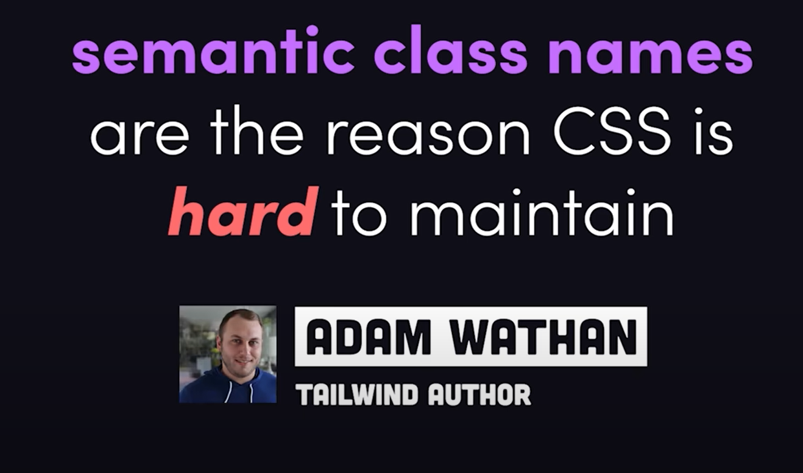

 

Frameworks like Bootstrap and Material address this problem by creating styles for **high-level components** - things like buttons, dropdowns and forms. 

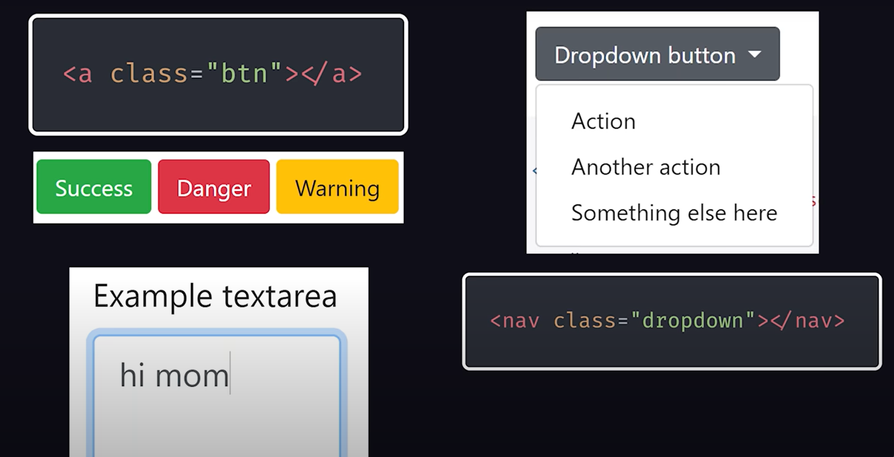

 

Tailwind takes a more *functional* approach, by providing you with utility classes that can be composed together to build components like this:

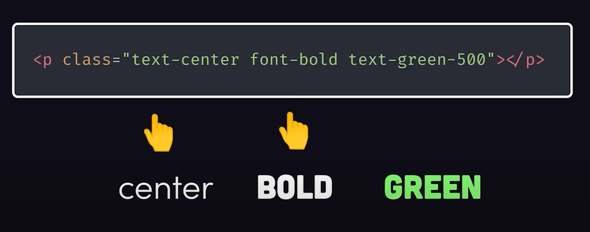

Instead of using the "card" class like you might in Bootstrap, you combine utility classes such as:

- `flex` == display: flex;
- `p-4` == padding: 1rem;
- `m-1` == margin: .25rem;
- `bg-green-50` == background-color: rgba(236, 123, 131);

 

### Conditional Styles

In addition, every utility can be applied conditionally. 

You have variants like small, medium and large for responsive designs...  

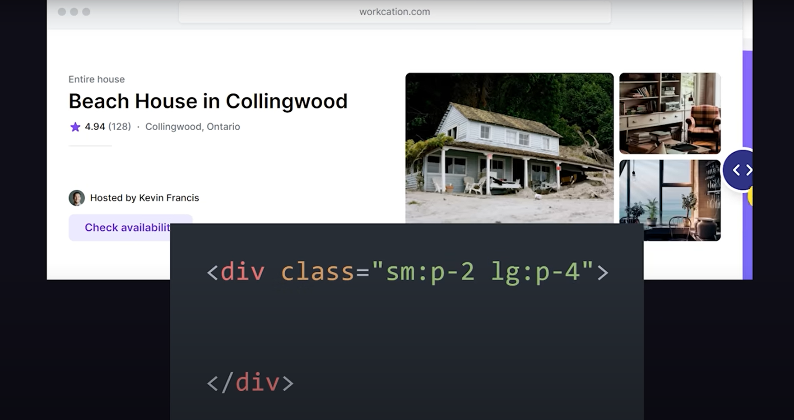

...along with a bunch of pseudo selectors like `hover:` and `focus:` to handle state changes.  

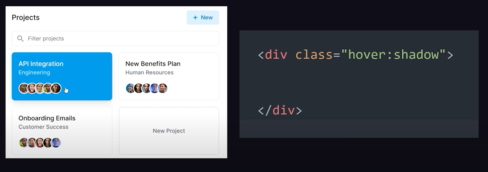

You also have `dark:` which renders different colors when dark mode is enabled.

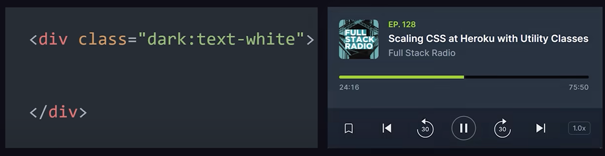

 

This approach gives you a lot more freedom over your creativity when compared to other CSS frameworks. 

 

### Design System

At the same time, using Tailwind provides a design system out of the box, which you don't get with plain CSS.

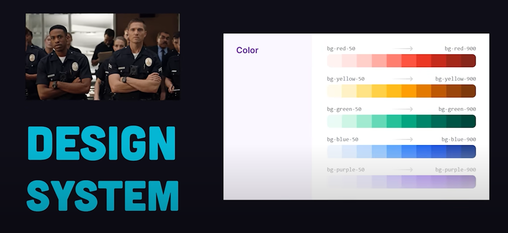

It lives in the sweet spot between convention and configuration

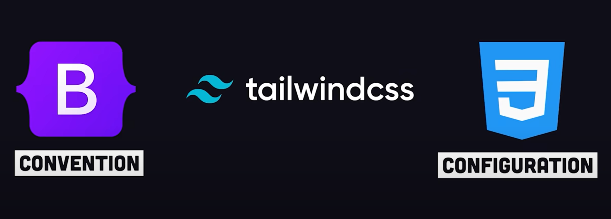

 

### Ugly HTML

The flipside is that it does create some ugly HTML - this is the big trade off!

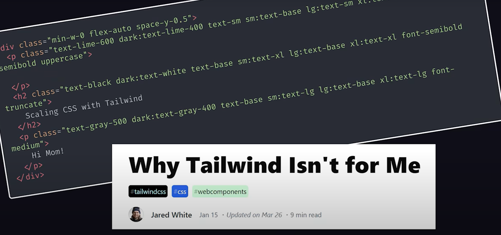

You have tonnes of hard to read, duplicate class names - as your UI grows *duplication will happen*!! 

 

You can avoid this by creating reusable components with a modern front-end JS framework! 

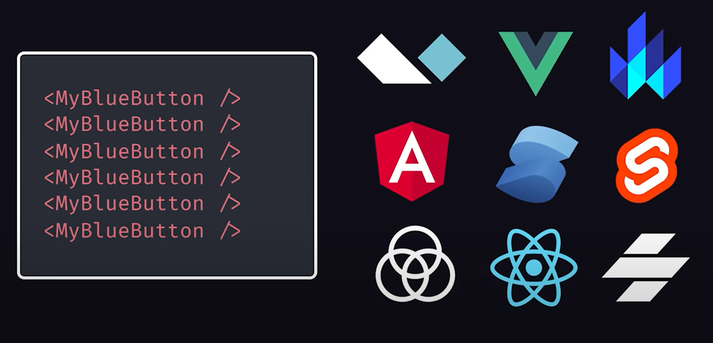

OR... by using the `@apply` directive in CSS to take tailwind classes and compose them into a single, concise class name. 

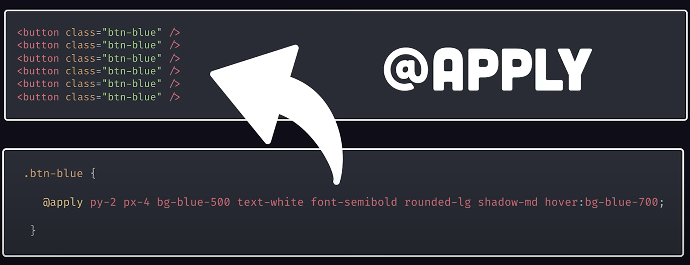

 

### Performance Concerns

Tailwind weighs in at 3,566kbs during development, but when you go to build for production, it will automatically purge any unused utility from the final bundle, resulting in minimal dead code, and thus faster page loads.

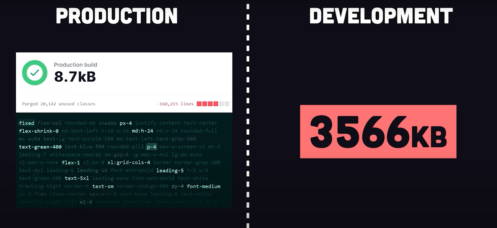

 

### Awesome Tooling! 

Where tailwind really shines is with its tooling. You don't need to memorize much because VS code will autocomplete every tailwind class for you. 

AND if you're not sure what it does, just hover over it and it will show you the equivalent code in plain CSS.

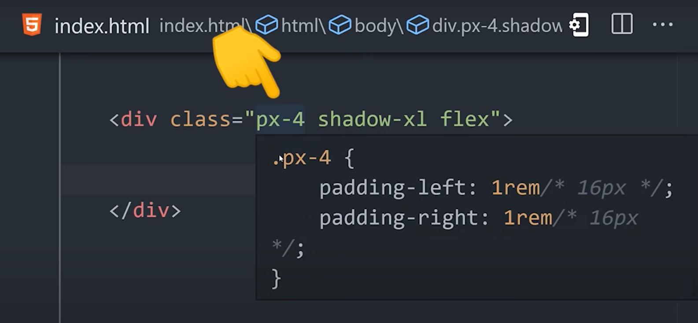

If you're not happy with what it does, you can easily customize everything from the colour palette, to the spacing, to build your own unique design system. 
