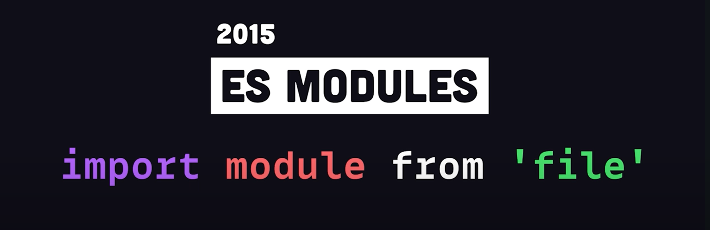

# Vite in 100s

Vite is a JS build tool that simplifies the way we build and develop frontend web applications. 

At its core it does two things: 

1) Serve your code locally during development

2) Bundle your CSS, JS and other assets together for development

 

### One of many similar tools

There are many tools out there that do the same thing - like Webpack - so what makes Vite different? 

It was created by Evan You in 2021, who also created **Vue.js**, as a way to both simplify and speed up the build process.

 

Not long ago, developers had no native way to combine JS files together in a modular way. 

This led to JS bundlers like **Webpack** and **Rollup** that concatenate multiple files together into a single bundle for the browser. The problem is that this process becomes increasingly slow as the app adds more code and dependencies. 

  

In 2015, EcmaScript (ES) Modules were introduced and by 2020 they had wide browser support... 

...allowing developers to import and export code from different files in the browser. 

**Vite** leverages native ES modules in the browser to load your code instantly, no matter how large the app is. 

It also supports **Hot Module Replacement** for an extremely fast feedback loop during development. 

 

### Uses Rollup under the hood when building for production

When building for production, Vite uses Rollup under the hood, so you don't have to worry about configuring it. 

### An opinionated tool!

Vite provides conventions that work out of the box for most developers.

 

### Getting Started

Run `npm init vite` from the command line. 

Then choose a starter project with your favourite frontend framework.

You'll notice the project comes with a **vite.config.ts** file.

It has a plugin ecosystem that can extend it with additional features, and you can also manually override the Rollup defaults when neccessary. 

There are some really cool plugins out there, like Vite SSR, that can do SSR like **Next.js**.  

  

To serve the application locally, run `npm run dev`. 

  

Even if you install a bunch of big dependencies like **Lodash** and **Moment**, the time to run the dev server does not change. 

If you open the **Network** tab in the browser's dev tools panel, you'll notice that instead of importing a single JS bundle file, it's importing our actual source code - like a raw tsx file in this case.

 

### Makes TypeScript 20/30x Faster

This is because it skips type checking and uses ES Build to transpile your code. 

  

As you're developing your app, you might change the state of it in the UI then realise that some of the code needs to change...

...when you modify the source code, the changes will be reflected instantly without losing that state of the application... 

That's what we call **Hot Module Replacement (HMR)!!**

  

Now, run `npm run build` to build the app for production. 

This will generate a JS bundle with Rollup, with a bunch of automatic optimizations, like automatic code-splitting, for any dynamic imports and CSS. 

