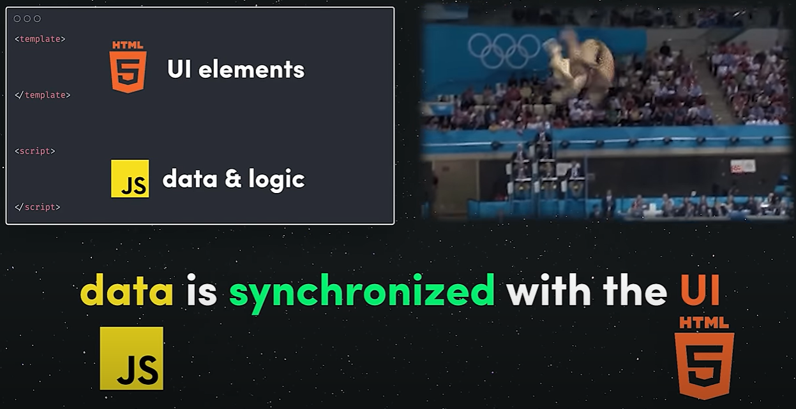
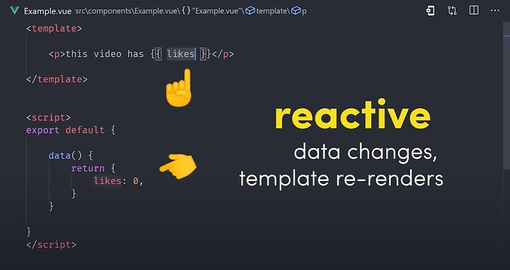
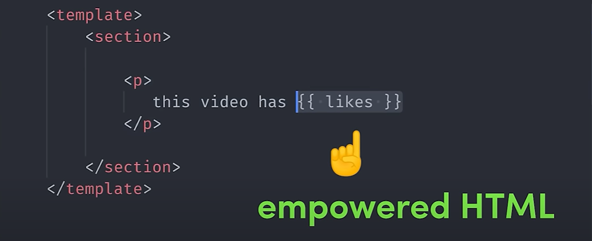
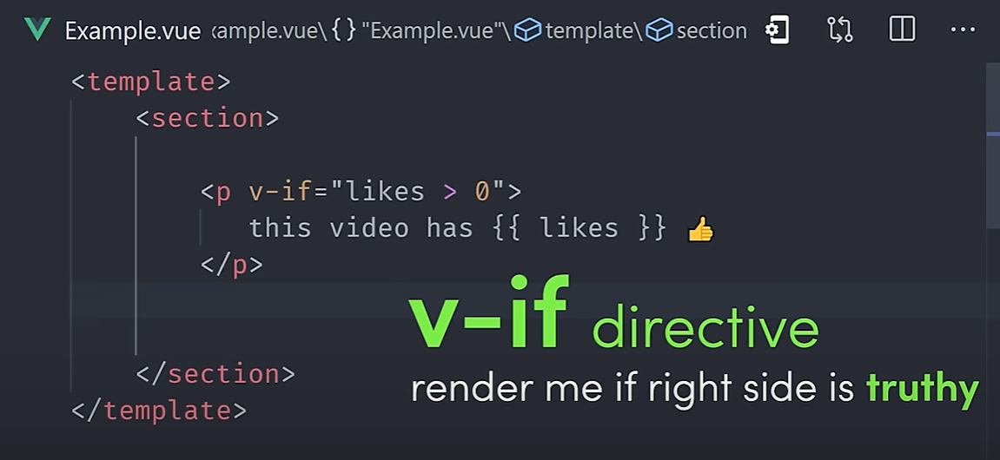
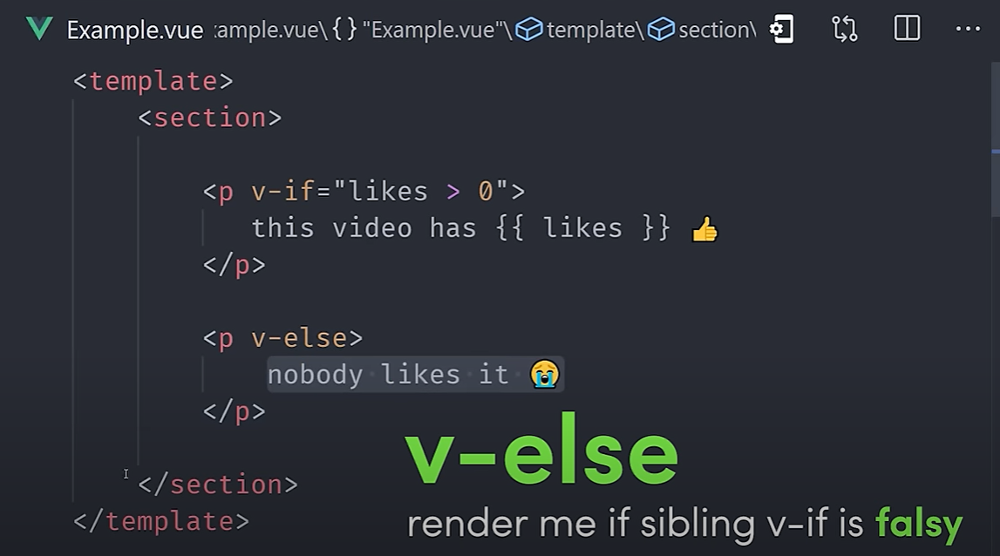
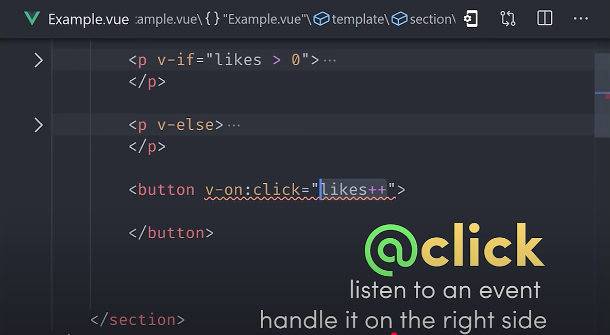
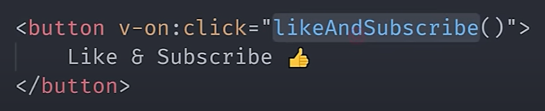
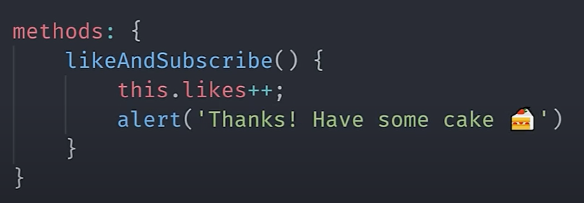
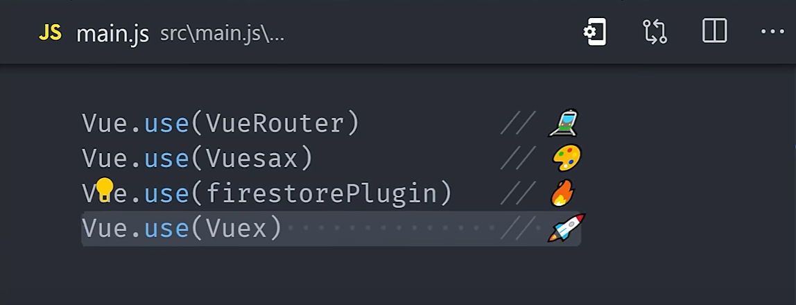

# Vue.js in 100s

Vue.js is a JavaScript framework for building UIs.

The creator refers to Vue.js as a "progressive framework" - meaning it can start small and scale up as large as needed.

It has the smallest learning curve compared to React and Angular. 

In vue you can start simple, and then progressively add in the tools you need to build a complex web application, such as...

- core view layer
- router
- state management
- CLI 

 

### Vue.js Components

At its core, it provides a way to build **components** that *encapsulate* data - **state** - in your JS, and then connect that state reactively to a template in HTML.

We call these components "declarative vues" because the same data inputs will always produce the same output in the visual UI.

 

### Vue.js Data

When we declare data on this data object, it links, or *binds* it to the HTML in the template above.

When the value of the data changes, the component will automatically **rerender** - or in other words it is **reactive**.

Vue.js does a tonne of work under the hood to ensure that this process is performant across a huge component tree, using **virtual DOM**.

 

### Vue.js template

We can work with this data in the template thanks to Vue's HTML-based template syntax.

We can *interpolate* a value or expression using double curly braces `{{ likes }}`.

#### **Directives**

We also have a variety of **directives** to control the behaviour of the HTML based on the data.

For example, we can use the `v-if` directive to only render an element if the condition is **truthy**.

We might have a fallback element after that that's only rendered when the value is **falsy**, with `v-else`.

 

### Vue.js declarative

We can make the app interactive by listening to events. 

Using the `v-on` directive we can listen to an event on an element, then run some code to handle that event on the right side. 

 

We can do that directly in the template, but can also define a custom method in the component's **method object**...

The method has access to our reactive data and that means all we have to do is change the value of the data and the component will automatically rerender...

 

And that is all it takes to build an *interactive, reactive, declarative* UI component with Vue. 

### Why is Vue.js loved by developers?

The framework is loved by developers for the simplicity, but also its ability to scale up in complexity incrementally.

Its plugin system allows you to easily drop in things like a **router**, **state management**, **firebase support** + more! 

 

And, **perhaps best of all**, it's not sponsored by some mega corporation like Google or Facebook. Therefore it's not pressured to push out new releases all the time, and does a great job listening to its community!! 

